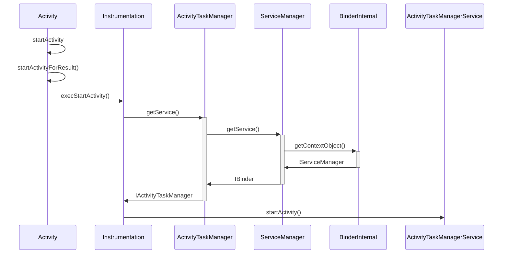

<!--more-->

# 目的
2018年搭建过博客之后就没继续用了，今年想把这几年在印象笔记、语雀的笔记分享出来。想再用时发现Next主题更新了好多版本，顺便把Hexo迁移到mac上面来。故把新增的过程做一个记录。
# 安装
首先下载安装git和node.js。其次是通过以下命令安装hexo。
```bash
sudo npm install -g hexo
```
新建一个用于存放博客文件的文件夹，我们为了后续方便更新文章或者在不同电脑使用，把放置博客的文件也托管到github上。如我自己的[博客源文件](https://github.com/i-rtfsc/blog)
而[https://github.com/i-rtfsc/i-rtfsc.github.io](https://github.com/i-rtfsc/i-rtfsc.github.io)就放置静态网页，其中project名字是i-rtfsc.github.io要跟你github名字对上。
在博客源文件夹下的_config.yml文件添加如下：
```bash
deploy:
  type: git
  repository: https://github.com/i-rtfsc/i-rtfsc.github.io.git
  branch: master
```
这样，你每写完一遍博客并执行hexo deploy，就会自动把静态网页上传到i-rtfsc.github.io仓。


# 更新 node
首先更新 npm
```bash
npm install -g npm
```
清除 npm 缓存
```bash
sudo npm cache clean -f
```


# 更新 hexo
进入自己的[博客目录](https://github.com/i-rtfsc/blog)，执行如下命令：

- 更新 package.json 中的 hexo 及个插件版本
```bash
npm install -g npm-check
npm install -g npm-upgrade
npm-check
npm-upgrade
```
如果执行npm-check不成功，可以换成npm-check -u，或者如下（版本号自己定）：
```bash
npm install --save hexo@5.4.0
npm install --save hexo-deployer-git@3.0.0
npm install --save hexo-generator-archive@1.0.0
npm install --save hexo-generator-category@1.0.0
npm install --save hexo-generator-index@2.0.0
npm install --save hexo-generator-tag@1.0.0
npm install --save hexo-renderer-ejs@1.0.0
npm install --save hexo-renderer-marked@4.1.0
npm install --save hexo-renderer-stylus@2.0.1 
npm install --save hexo-server@2.0.0
```

- 更新 hexo 及所有插件
```bash
npm update
```

- 查看版本号
```bash
hexo version
```

- 主题

主题变化很大，github仓都不一样，如果之前有配置过，则先把themes文件夹删除，然后通过git submodule方式下载。
下载完成后到根目录下的_config.yml在theme：后添加next即可。
```bash
git submodule add https://github.com/theme-next/hexo-theme-next themes/next
```
​

# 根目录下_config.yml
## Site
```bash
# Site
title: Solo
subtitle: anqi.huang@outlook.com
description: 重学Android系列
keywords: Android、Framework
author: Solo
language: zh-CN
timezone: UTC
```

- title: 填写标题
- subtitle: 填写副标题
- description: 简介
- keywords: 关键词
- author: 作者，文章中显示的作者名称
- language: 设置语言，zh-CN是简体中文，en是英语，默认是德语


## URL
文章永久链接插件安装命令如下：
```bash
npm install hexo-abbrlink --save
```
修改配置文件_config.yml如下：
```bash
url: http://i-rtfsc.com
root: /
permalink: archives/:abbrlink.html
abbrlink:
  alg: crc32  # 算法：crc16(default) and crc32
  rep: hex    # 进制：dec(default) and hex
permalink_defaults:
```


## 翻页设置
```bash
# Home page setting
# path: Root path for your blogs index page. (default = '')
# per_page: Posts displayed per page. (0 = disable pagination)
# order_by: Posts order. (Order by date descending by default)
index_generator:
  path: ''
  per_page: 12
  order_by: -date
  
# Pagination
## Set per_page to 0 to disable pagination
per_page: 12
pagination_dir: page
```
共有两处，用于控制每一页显示多少篇博文，per_page:后设置博文数量，0代表不翻页全部平铺显示。
​

## Deployment设置
```bash
# Deployment
## Docs: https://hexo.io/docs/deployment.html
deploy:
  type: git
  repository: https://github.com/i-rtfsc/i-rtfsc.github.io.git
  branch: master
```

- branch:分支填写master
- repo:后把username换成自己的用户名


# 主题目录下_config.yml
## 推荐文章插件
安装插件命令如下：
```bash
npm install hexo-related-popular-posts --save
```
修改配置文件_config.yml如下：
```bash
related_posts:
  enable: true
  title: 推荐文章 # Custom header, leave empty to use the default one
  display_in_home: false
  params:
    maxCount: 5
    PPMixingRate: 0.25
    isDate: false
    isImage: false
    isExcerpt: false
```

## 文章排序
安装插件命令如下：
```bash
npm install hexo-generator-index-pin-top --save
```
然后打开任何一篇博客,加上top属性,top后面数字越大优先级越大。
```bash
top: 01
```
修改node_modules/hexo-generator-index/lib/generator.js
就可以变成：
1. 默认按照发布时间排序
2. 设置top可以置顶，top的值越大优先级越大
```bash
//sort(posts.data, (a, b) => (b.sticky || 0) - (a.sticky || 0));
posts.data = posts.data.sort(function(a, b) {
    if(a.top && b.top) { // 两篇文章top都有定义
        if(a.top == b.top) return b.date - a.date; // 若top值一样则按照文章日期降序排
        else return b.top - a.top; // 否则按照top值降序排
    }
    else if(a.top && !b.top) { // 以下是只有一篇文章top有定义，那么将有top的排在前面（这里用异或操作居然不行233）
        return -1;
    }
    else if(!a.top && b.top) {
        return 1;
    }
    else return b.date - a.date; // 都没定义按照文章日期降序排
});
```


## 本地搜索功能
安装插件命令如下：
```bash
npm install hexo-generator-searchdb --save
```
修改配置文件_config.yml如下：
```bash
# 本地搜索
search:
  path: search.xml
  field: post
  format: html
  limit: 100
```

- path：索引文件的路径，相对于站点根目录
- field：搜索范围，默认是 post，还可以选择 page、all，设置成 all 表示搜索所有页面
- limit：限制搜索的条目数

然后修改主题配置文件_config.yml如下：
```bash
# Local Search
# Dependencies: https://github.com/theme-next/hexo-generator-searchdb
local_search:
  enable: true
  # If auto, trigger search by changing input.
  # If manual, trigger search by pressing enter key or search button.
  trigger: auto
  # Show top n results per article, show all results by setting to -1
  top_n_per_article: 1
  # Unescape html strings to the readable one.
  unescape: false
  # Preload the search data when the page loads.
  preload: false
```


## 网站Logo设置
把选好的图标放入\themes\next\source\images目录中并改成上面的文件名即可，注意图片尺寸。
```bash
favicon:
  small: /images/favicon-16x16-next.png
  medium: /images/favicon-32x32-next.png
  apple_touch_icon: /images/apple-touch-icon-next.png
```


## 页脚设置
```bash
footer:
  # Specify the date when the site was setup. If not defined, current year will be used.
  since: 2018

  # Icon between year and copyright info.
  icon:
    # Icon name in fontawesome, see: https://fontawesome.com/v4.7.0/icons/
    # `heart` is recommended with animation in red (#ff0000).
    name: heart
    # If you want to animate the icon, set it to true.
    animated: true
    # Change the color of icon, using Hex Code.
    color: "#f08080"

  # If not defined, `author` from Hexo main config will be used.
  copyright: Solo

  powered:
    # Hexo link (Powered by Hexo).
    enable: true
    # Version info of Hexo after Hexo link (vX.X.X).
    version: true

  theme:
    # Theme & scheme info link (Theme - NexT.scheme).
    enable: true
    # Version info of NexT after scheme info (vX.X.X).
    version: true
```

- since: 表示网站成立的年份，不设置的话默认是当前年份，显示为© 2021
- icon: 中设置年份后面的图标，默认是心形，想修改的话去Fontawesome选择图标，然后再name栏修改
- animated: 用于设置心形是否跳动
- color: 用于设置图标颜色，百度对照色表查就好
- copyright: 显示图标后面的版权所属，也就是作者名，不设置的话默认显示根目录配置文件中的作者名
- powered: 后面的栏目用于设定是否显示Powered by Hexo以及当前主题的版本信息，显示的话设为true
- theme: 后面的栏目用于设定是否显示当前主题的版本信息，显示的话将设为true


## Github角标
```bash
# Github角标
github_banner:
  enable: true
  permalink: https://github.com/i-rtfsc
  title: Follow me on GitHub
```


## 社交网站链接设置
```bash
social:
  GitHub: https://github.com/i-rtfsc || github
  E-Mail: mailto:anqi.huang@outlook.com || envelope
```


## 头像设置
用于设置是否在侧边栏显示头像
```bash
avatar:
  # In theme directory (source/images): /images/avatar.gif
  # In site directory (source/uploads): /uploads/avatar.gif
  # You can also use other linking images.
  url: /images/avatar.gif
  # If true, the avatar would be dispalyed in circle.
  rounded: true
  # The value of opacity should be choose from 0 to 1 to set the opacity of the avatar.
  opacity: 1
  # If true, the avatar would be rotated with the cursor.
  rotated: true
```

- url:后填写头像图片的路径，默认在\themes\next\source\images中
- rounded:用于设置是否显示圆形头像
- opacity:用于设置头像透明度，1为不透明
- rotated:用于设置头像鼠标移动到头像上时头像是否旋转


## 侧边栏目录设置
```bash
toc:
  enable: true
  # Automatically add list number to toc.
  number: true
  # If true, all words will placed on next lines if header width longer then sidebar width.
  wrap: false
  # If true, all level of TOC in a post will be displayed, rather than the activated part of it.
  expand_all: true
  # Maximum heading depth of generated toc. You can set it in one post through `toc_max_depth` in Front Matter.
  max_depth: 6
```

- enable:用于设置是否开启侧边栏目录
- number:用于设置自动编号
- wrap:用于设置当标题长度超过侧边栏长度时是否自动换行
- expand_all:用于设置是否展开全部目录，否的话会自动展开正在看的那部分
- max_depth:用于设置自动生成目录的最大深度，也就是生成到几级标题


## 侧边栏显示设置
```bash
sidebar:
  # Sidebar Position, available values: left | right (only for Pisces | Gemini).
  #position: left
  position: right

  # Manual define the sidebar width. If commented, will be default for:
  # Muse | Mist: 320
  # Pisces | Gemini: 240
  width: 320

  # Sidebar Display, available values (only for Muse | Mist):
  #  - post    expand on posts automatically. Default.
  #  - always  expand for all pages automatically.
  #  - hide    expand only when click on the sidebar toggle icon.
  #  - remove  totally remove sidebar including sidebar toggle.
  display: post

  # Sidebar offset from top menubar in pixels (only for Pisces | Gemini).
  offset: 12
  # Enable sidebar on narrow view (only for Muse | Mist).
  onmobile: false
  # Click any blank part of the page to close sidebar (only for Muse | Mist).
  dimmer: false
```

- position:用于设置侧边栏在左边还是右边，把要选择的位置前面的#去掉再把另一个前面加上#即可，这个选项只对Pisces和Gemini两个主题起作用
- width:用于设置侧边栏的宽度，默认Muse和Mist是320,Pisces和Gemini是240
- display:用于设置侧边栏的显示方式，只对Muse和Mist两个主题起作用，可以挨个试一下
- offset:用于设置侧边栏距离顶部介绍的距离，只对Pisces和Gemini两个主题起作用
- onmobile:用于设置是否在手机等宽度较小的设备上显示侧边栏，只对Muse和Mist两个主题起作用
- dimmer:用于设置点击屏幕空白处是否关闭侧边栏，同样只对Muse和Mist两个主题起作用


## 返回顶部按钮
```bash
back2top:
  enable: true
  # Back to top in sidebar.
  sidebar: true
  # Scroll percent label in b2t button.
  scrollpercent: true
```

- enable:用于设置是否开启回到顶部按钮
- sidebar:用于设置是否将按钮放到侧边栏中
- scrollpercent:用于设置是否显示阅读进度百分比


## 代码块高亮主题
Next主题内置了tomorrow代码高亮主题，一共有五个，可以去Tomorrow查看预览效果，在下面的highlight_theme:中改成自己想要的即可。
```bash
# 代码块高亮主题
codeblock:
  # Code Highlight theme
  # Available values: normal | night | night eighties | night blue | night bright | solarized | solarized dark | galactic
  # See: https://github.com/chriskempson/tomorrow-theme
  highlight_theme: night
  # Add copy button on codeblock
  copy_button:
    enable: true
    # Show text copy result.
    show_result: false
    # Available values: default | flat | mac
    style: mac
```


## Mermaid
近来用Markdown写文章，越来越不喜欢插入图片了，一切能用语法解决的问题坚决不放图，原因有二：

- 如果把流程图和数学公式都以图片方式放到文章内，当部署到Github上后，访问博客时图片加载实在太慢，有时一篇文章需要画10来个流程图，那你就得截图10来多次，还得给这些图片想一个合适的名字，同时插入图片的时候还要注意图片的插入位置和顺序；
- 如果你要把文章发布到其他博客平台，如CSDN、博客园，在每一个平台上你都要插入10来多次图片，作为程序员，这种笨拙又耗时的方法，我实在不能忍。

这也是我为什么放弃印象笔记改用语雀的一大主要原因。语雀里有一个功能“文本绘图”可以用PlantUML、Mermaid、Flowchart、Graphviz等。如下如就是用Mermaid绘制的。

我们现在想办法在hexo上也能用上这个插件，首先使用以下命令安装插件：（最新版本hexo就自带了，无需安装）
```bash
npm install hexo-filter-mermaid-diagrams --save
```
修改
```bash
# Mermaid tag
mermaid:
  enable: true
  # Available themes: default | dark | forest | neutral
  theme: neutral
```
并在themes/next/source/css/_common/components/components.styl添加：
```bash
.mermaid {
 background: transparent;
}
```
添加这个目前是为了避免你设置黑色主题时背景为黑色导致看不到流程，不一定是加在components.styl，你可以找个合适的地方。
​

# 深度美化
## 字数和阅读时间统计插件
安装插件命令如下：
```bash
npm install hexo-symbols-count-time --save
```
修改配置文件_config.yml如下：
```bash
symbols_count_time:
  symbols: true # 文章字数
  time: true # 阅读时长
  total_symbols: true # 所有文章总字数
  total_time: true # 所有文章阅读中时长
```


## 鼠标点击特效
在网页中加入鼠标点击特效，目前有心形和爆炸两种特效，两者可以叠加，特效对性能较低的设备非常不友好，尤其是爆炸特效，在平板上卡成PPT，慎用……
### 心形特效

- 创建js文件

在./themes/next/source/js中新建clicklove.js，并将粘贴下列代码。
```bash
!function(e,t,a){function n(){c(".heart{width: 10px;height: 10px;position: fixed;background: #f00;transform: rotate(45deg);-webkit-transform: rotate(45deg);-moz-transform: rotate(45deg);}.heart:after,.heart:before{content: '';width: inherit;height: inherit;background: inherit;border-radius: 50%;-webkit-border-radius: 50%;-moz-border-radius: 50%;position: fixed;}.heart:after{top: -5px;}.heart:before{left: -5px;}"),o(),r()}function r(){for(var e=0;e<d.length;e++)d[e].alpha<=0?(t.body.removeChild(d[e].el),d.splice(e,1)):(d[e].y--,d[e].scale+=.004,d[e].alpha-=.013,d[e].el.style.cssText="left:"+d[e].x+"px;top:"+d[e].y+"px;opacity:"+d[e].alpha+";transform:scale("+d[e].scale+","+d[e].scale+") rotate(45deg);background:"+d[e].color+";z-index:99999");requestAnimationFrame(r)}function o(){var t="function"==typeof e.onclick&&e.onclick;e.onclick=function(e){t&&t(),i(e)}}function i(e){var a=t.createElement("div");a.className="heart",d.push({el:a,x:e.clientX-5,y:e.clientY-5,scale:1,alpha:1,color:s()}),t.body.appendChild(a)}function c(e){var a=t.createElement("style");a.type="text/css";try{a.appendChild(t.createTextNode(e))}catch(t){a.styleSheet.cssText=e}t.getElementsByTagName("head")[0].appendChild(a)}function s(){return"rgb("+~~(255*Math.random())+","+~~(255*Math.random())+","+~~(255*Math.random())+")"}var d=[];e.requestAnimationFrame=function(){return e.requestAnimationFrame||e.webkitRequestAnimationFrame||e.mozRequestAnimationFrame||e.oRequestAnimationFrame||e.msRequestAnimationFrame||function(e){setTimeout(e,1e3/60)}}(),n()}(window,document);
```

- 修改layout文件

打开./themes/next/layout/_layout.swig并在末尾添加以下代码。
```bash
<!-- 页面点击心形 -->
<script type="text/javascript" src="/js/clicklove.js"></script>
```


### 爆炸特效

- 创建js文件

在./themes/next/source/js中新建firework.js，并将粘贴下列代码。
```bash
"use strict";function updateCoords(e){pointerX=(e.clientX||e.touches[0].clientX)-canvasEl.getBoundingClientRect().left,pointerY=e.clientY||e.touches[0].clientY-canvasEl.getBoundingClientRect().top}function setParticuleDirection(e){var t=anime.random(0,360)*Math.PI/180,a=anime.random(50,180),n=[-1,1][anime.random(0,1)]*a;return{x:e.x+n*Math.cos(t),y:e.y+n*Math.sin(t)}}function createParticule(e,t){var a={};return a.x=e,a.y=t,a.color=colors[anime.random(0,colors.length-1)],a.radius=anime.random(16,32),a.endPos=setParticuleDirection(a),a.draw=function(){ctx.beginPath(),ctx.arc(a.x,a.y,a.radius,0,2*Math.PI,!0),ctx.fillStyle=a.color,ctx.fill()},a}function createCircle(e,t){var a={};return a.x=e,a.y=t,a.color="#F00",a.radius=0.1,a.alpha=0.5,a.lineWidth=6,a.draw=function(){ctx.globalAlpha=a.alpha,ctx.beginPath(),ctx.arc(a.x,a.y,a.radius,0,2*Math.PI,!0),ctx.lineWidth=a.lineWidth,ctx.strokeStyle=a.color,ctx.stroke(),ctx.globalAlpha=1},a}function renderParticule(e){for(var t=0;t<e.animatables.length;t++){e.animatables[t].target.draw()}}function animateParticules(e,t){for(var a=createCircle(e,t),n=[],i=0;i<numberOfParticules;i++){n.push(createParticule(e,t))}anime.timeline().add({targets:n,x:function(e){return e.endPos.x},y:function(e){return e.endPos.y},radius:0.1,duration:anime.random(1200,1800),easing:"easeOutExpo",update:renderParticule}).add({targets:a,radius:anime.random(80,160),lineWidth:0,alpha:{value:0,easing:"linear",duration:anime.random(600,800)},duration:anime.random(1200,1800),easing:"easeOutExpo",update:renderParticule,offset:0})}function debounce(e,t){var a;return function(){var n=this,i=arguments;clearTimeout(a),a=setTimeout(function(){e.apply(n,i)},t)}}var canvasEl=document.querySelector(".fireworks");if(canvasEl){var ctx=canvasEl.getContext("2d"),numberOfParticules=30,pointerX=0,pointerY=0,tap="mousedown",colors=["#FF1461","#18FF92","#5A87FF","#FBF38C"],setCanvasSize=debounce(function(){canvasEl.width=2*window.innerWidth,canvasEl.height=2*window.innerHeight,canvasEl.style.width=window.innerWidth+"px",canvasEl.style.height=window.innerHeight+"px",canvasEl.getContext("2d").scale(2,2)},500),render=anime({duration:1/0,update:function(){ctx.clearRect(0,0,canvasEl.width,canvasEl.height)}});document.addEventListener(tap,function(e){"sidebar"!==e.target.id&&"toggle-sidebar"!==e.target.id&&"A"!==e.target.nodeName&&"IMG"!==e.target.nodeName&&(render.play(),updateCoords(e),animateParticules(pointerX,pointerY))},!1),setCanvasSize(),window.addEventListener("resize",setCanvasSize,!1)}"use strict";function updateCoords(e){pointerX=(e.clientX||e.touches[0].clientX)-canvasEl.getBoundingClientRect().left,pointerY=e.clientY||e.touches[0].clientY-canvasEl.getBoundingClientRect().top}function setParticuleDirection(e){var t=anime.random(0,360)*Math.PI/180,a=anime.random(50,180),n=[-1,1][anime.random(0,1)]*a;return{x:e.x+n*Math.cos(t),y:e.y+n*Math.sin(t)}}function createParticule(e,t){var a={};return a.x=e,a.y=t,a.color=colors[anime.random(0,colors.length-1)],a.radius=anime.random(16,32),a.endPos=setParticuleDirection(a),a.draw=function(){ctx.beginPath(),ctx.arc(a.x,a.y,a.radius,0,2*Math.PI,!0),ctx.fillStyle=a.color,ctx.fill()},a}function createCircle(e,t){var a={};return a.x=e,a.y=t,a.color="#F00",a.radius=0.1,a.alpha=0.5,a.lineWidth=6,a.draw=function(){ctx.globalAlpha=a.alpha,ctx.beginPath(),ctx.arc(a.x,a.y,a.radius,0,2*Math.PI,!0),ctx.lineWidth=a.lineWidth,ctx.strokeStyle=a.color,ctx.stroke(),ctx.globalAlpha=1},a}function renderParticule(e){for(var t=0;t<e.animatables.length;t++){e.animatables[t].target.draw()}}function animateParticules(e,t){for(var a=createCircle(e,t),n=[],i=0;i<numberOfParticules;i++){n.push(createParticule(e,t))}anime.timeline().add({targets:n,x:function(e){return e.endPos.x},y:function(e){return e.endPos.y},radius:0.1,duration:anime.random(1200,1800),easing:"easeOutExpo",update:renderParticule}).add({targets:a,radius:anime.random(80,160),lineWidth:0,alpha:{value:0,easing:"linear",duration:anime.random(600,800)},duration:anime.random(1200,1800),easing:"easeOutExpo",update:renderParticule,offset:0})}function debounce(e,t){var a;return function(){var n=this,i=arguments;clearTimeout(a),a=setTimeout(function(){e.apply(n,i)},t)}}var canvasEl=document.querySelector(".fireworks");if(canvasEl){var ctx=canvasEl.getContext("2d"),numberOfParticules=30,pointerX=0,pointerY=0,tap="mousedown",colors=["#FF1461","#18FF92","#5A87FF","#FBF38C"],setCanvasSize=debounce(function(){canvasEl.width=2*window.innerWidth,canvasEl.height=2*window.innerHeight,canvasEl.style.width=window.innerWidth+"px",canvasEl.style.height=window.innerHeight+"px",canvasEl.getContext("2d").scale(2,2)},500),render=anime({duration:1/0,update:function(){ctx.clearRect(0,0,canvasEl.width,canvasEl.height)}});document.addEventListener(tap,function(e){"sidebar"!==e.target.id&&"toggle-sidebar"!==e.target.id&&"A"!==e.target.nodeName&&"IMG"!==e.target.nodeName&&(render.play(),updateCoords(e),animateParticules(pointerX,pointerY))},!1),setCanvasSize(),window.addEventListener("resize",setCanvasSize,!1)};
```

- 修改layout文件

打开./themes/next/layout/_layout.swig并在<head>中间添加以下代码。
```bash
  <!-- 爆炸效果 -->
<canvas class="fireworks" style="position: fixed;left: 0;top: 0;z-index: 1; pointer-events: none;" ></canvas> 
<script type="text/javascript" src="//cdn.bootcss.com/animejs/2.2.0/anime.min.js"></script> 
<script type="text/javascript" src="/js/firework.js"></script>
```

- 配置主题文件

打开./themes/next路径下的_config.yml文件并在末尾添加以下代码。
```bash
# Fireworks
fireworks: true
```


## 博文压缩
md文件转化为html后会有很多空格，js和css文件中也会有许多空格，js中的空格会影响性能。

- 安装
```bash
npm install hexo-neat --save
```

- 配置

打开博客根目录下的配置文件_config.yml并在末尾添加如下代码：
```bash
# hexo-neat
# 博文压缩
neat_enable: true
# 压缩html
neat_html:
  enable: true
  exclude:
# 压缩css
neat_css:
  enable: true
  exclude:
    - '**/*.min.css'
# 压缩js
neat_js:
  enable: true
  mangle: true
  output:
  compress:
  exclude:
    - '**/*.min.js'
    - '**/jquery.fancybox.pack.js'
    - '**/index.js'
    - '**/clicklove.js'
    - '**/firework.js'
```
> 可能会有部分插件压缩后报错，在exclude里面添加对应的文件就可以取消压缩了

​

## 访客统计
Next主题已经内置了不统计，在Next主题的配置文件_config.yml中搜索busuanzi_count并将enable设置为true，icon可以自定义设置，下面是我的配置：
```bash
busuanzi_count:
  enable: true
  total_visitors: true # 总访客数量，在页脚显示
  total_visitors_icon: user
  total_views: true # 总阅读数量，在页脚显示
  total_views_icon: eye
  post_views: true # 单篇文章阅读数量，在标题下显示
  post_views_icon: eye
```


## 添加评论系统
评论系统采用的是Gitalk，与原来的Gitment差不多(Gitment已经凉了)。新版本的Next主题已经自带Gitalk了，我们只需要开启即可，下面的安装过程请忽略。
### 注册OAuth application
点击[这里](https://github.com/settings/applications/new)注册新的OAuth application

- 其中Application name随便填就好
- Homepage URL和Authorization callback URL填写自己的网站首页地址即可
- Application description选填，记录这个东西是干什么的

填写完成后点击Register application，跳转页面会显示Client ID和Client Secret用于以后登录。
​

### 配置
打开Next主题的配置文件.\themes\next\_config.yml并搜索gitalk，将enable设置为true,并配置相关选项。
```bash
# Gitalk
# For more information: https://gitalk.github.io, https://github.com/gitalk/gitalk
gitalk:
  enable: true
  github_id: i-rtfsc # 你的github用户名(GitHub repo owner)
  repo: i-rtfsc.github.io # Repository name to store issues
  client_id: fe0e1f117dc426e14e98 # GitHub Application Client ID
  client_secret: b5e4d8cb3d52a38ce7bb19f2894fbc6d7248b8d4 # GitHub Application Client Secret
  admin_user: i-rtfsc # GitHub repo owner and collaborators, only these guys can initialize gitHub issues
  distraction_free_mode: true # Facebook-like distraction free mode
  # Gitalk's display language depends on user's browser or system environment
  # If you want everyone visiting your site to see a uniform language, you can set a force language value
  # Available values: en | es-ES | fr | ru | zh-CN | zh-TW
  language: zh-CN
```


## 背景及半透明效果
将选好的背景图片放在博客根目录/themes/next/source/images中。打开根目录/themes/next/source/css/_common/components/components.styl文件添加如下代码。
```bash
body {
    background:url(/images/background.jpeg);//图片路径
    background-repeat: no-repeat;//是否重复平铺
    background-attachment:fixed;//是否随着网页上下滚动而滚动，fixed为固定
    background-position:50% 50%;//图片位置
    background-size: cover;//图片展示大小
    -webkit-background-size: cover;
    -o-background-size: cover;
    -moz-background-size: cover;
    -ms-background-size: cover;

     #footer > div > div {
        color:#000000;//底部文字颜色
    }
}

.header-inner {
    background: #ffffffe8;//设置侧边栏透明
    opacity: 1;//这里设置为1，否则搜索栏会消失
}
.main-inner {
        background: #fff;
        opacity: 0.9;//设置文章主体透明度
}
```


## 文章宽度过小
我们配置的scheme是Mist，运行后发现文章宽度过小，需要修改themes/next/source/css/_schemes/Mist/_layout.styl配置如下：
```bash
.main-inner {
  padding: 20px;
  width: 85%;
  +mobile() {
    +tablet() {
        width: 100%;
    }
    +mobile() {
        width: 100%;
    }
  }
}
```


## 网站底部加上访问量
在themes\next\layout\_partials\footer.swig添加：
```bash
<div class="powered-by">
<i class="fa fa-user-md"></i><span id="busuanzi_container_site_uv">
  本站总访问量<span id="busuanzi_value_site_uv"></span>次
</span>
</div>
```

- pv的方式，单个用户连续点击n篇文章，记录n次访问量
```bash
<span id="busuanzi_container_site_pv">
    本站总访问量<span id="busuanzi_value_site_pv"></span>次
</span>
```

- uv的方式，单个用户连续点击n篇文章，只记录1次访客数
```bash
<span id="busuanzi_container_site_uv">
  本站总访问量<span id="busuanzi_value_site_uv"></span>次
</span>
```
​

## 文章显示图片
在文章头部添加：
```bash
<meta name="referrer" content="no-referrer"/>
```
引用图片方式如下：
```bash

```

## 首页文章区域添加阴影
在目录/themes/next/source/css/_common/components/components.styl文件添加如下代码。
```bash
.post {
  margin-top: 60px;
  margin-bottom: 60px;
  padding: 25px;
  -webkit-box-shadow: 0 0 5px rgba(202, 203, 203, .5);
  -moz-box-shadow: 0 0 5px rgba(202, 203, 204, .5);
 }
```

## 打开“关于”、“分类”、“标签”

```bash
hexo new page "about"
生成source/about/index.md
---
title: about
date: 2021-10-07 18:14:14
---
添加type: "about"


hexo new page "tags"
生成source/tags/index.md
---
title: tags
date: 2021-10-07 18:14:14
---
添加type: "tags"


hexo new page "categories"
生成source/tags/index.md
---
title: categories
date: 2021-10-07 18:14:14
---
添加type: "categories"
```


# 附
| 命令 | 含义 | 简写 |
| --- | --- | --- |
| npm install hexo -g | 安装   | 无 |
| npm update hexo -g | 升级 | 无 |
| hexo init | 初始化 | 无 |
| hexo new | hexo new "new article"  //新建文章‘new article’<br>hexo new page "about"  //新建页面 ‘about’ | hexo n |
| hexo generate | 使用 Hexo 生成静态文件快速而且简单<br>hexo generate --watch #监视文件变动 | hexo g |
| hexo server | 启动服务预览<br>hexo server -s #静态模式<br>hexo server -p 5000 #更改端口<br>hexo server -i 192.168.1.1 #自定义 IP | hexo s |
| hexo deploy | 部署(自动上传代码到github) | hexo d |


# 参考
[Next主题美化](https://siriusq.top/Next%E4%B8%BB%E9%A2%98%E7%BE%8E%E5%8C%96.html)
[Next升级-Mac迁移](https://siriusq.top/Next%E5%8D%87%E7%BA%A7-Mac%E8%BF%81%E7%A7%BB.html)
[Hexo-NexT 主题使用总结](https://doingself.github.io/2017/06/16/2017-06-16-Hexo%E4%B8%BB%E9%A2%98-NexT-%E4%BD%BF%E7%94%A8%E6%80%BB%E7%BB%93/)

