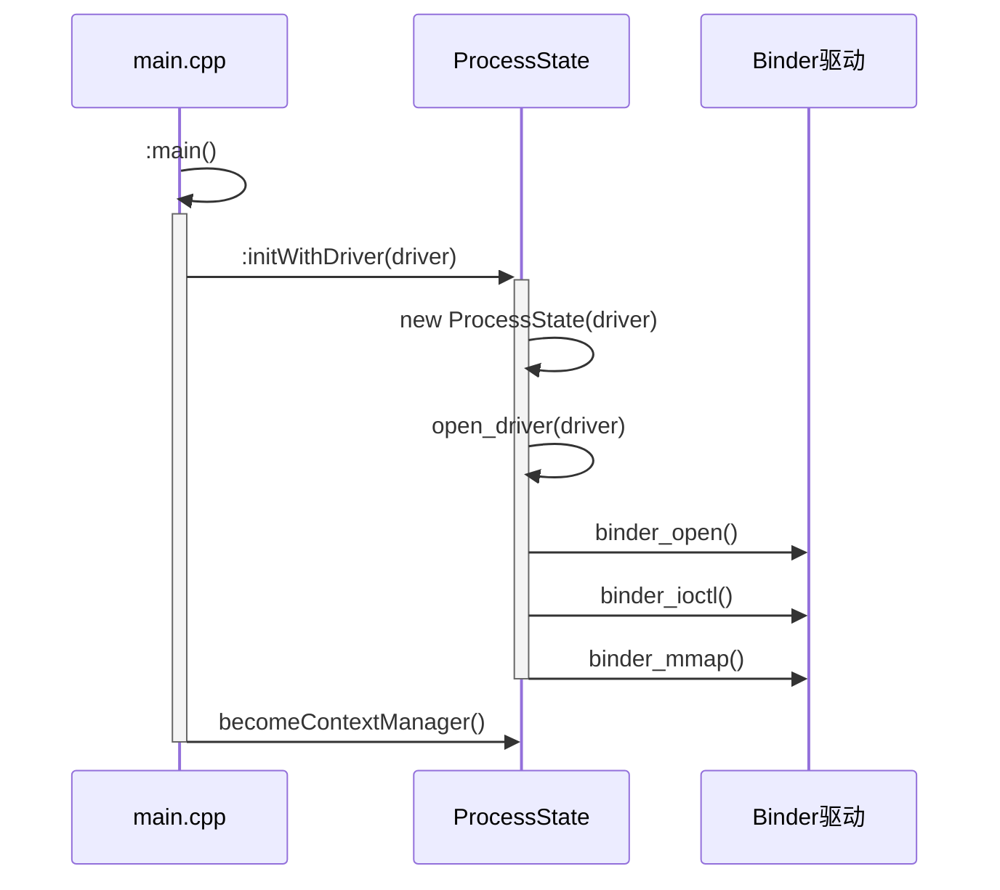
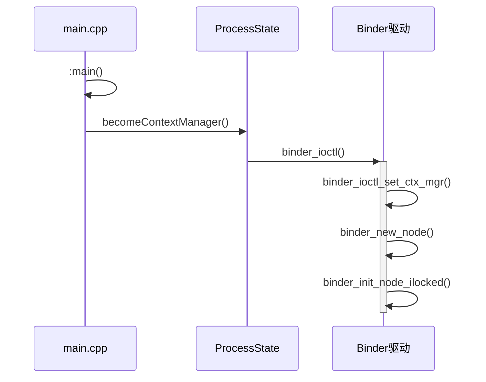
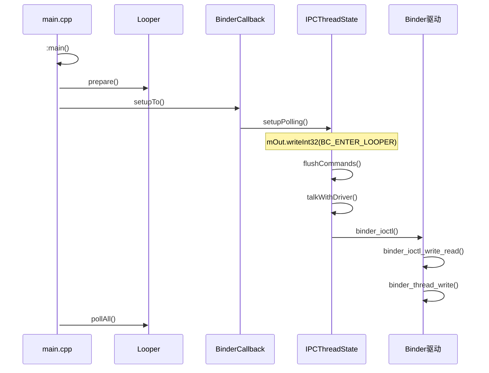
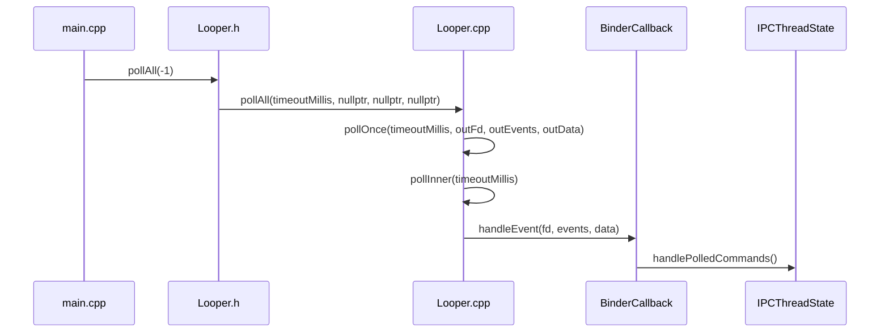

<!--more-->
<meta name="referrer" content="no-referrer"/>


# Binder机制文章列表
[Binder概述](https://journeyos.github.io/archives/d6aea0f1.html)
[Binder机制01-驱动](https://journeyos.github.io/archives/3e87e0ce.html)
[Binder机制02-ServiceManager](https://journeyos.github.io/archives/f17b1d52.html)
[Binder机制03-Framework-Native](https://journeyos.github.io/archives/937d16d8.html)
[Binder机制04-Framework-Jave](https://journeyos.github.io/archives/73029508.html)
[Binder机制05-AIDL](https://journeyos.github.io/archives/ed3eb50b.html)
[Binder机制06-框架](https://journeyos.github.io/archives/4e7f84b4.html)
[Binder机制07-实例分析](https://journeyos.github.io/archives/d30c7ecb.html)
[Binder机制08-总结](https://journeyos.github.io/archives/720ded9.html)
[Ashmem简介（Android IPC传输大数据）](https://journeyos.github.io/archives/f1684132.html)


Service Manager是整个Binder机制的守护进程，用来管理开发者创建的各种Server，并且向Client提供查询Server远程接口的功能。Service Manager在init.rc中作为service启动，运行在一个独立的进程中。而Client和Server也运行在独立的进程中。如果Client和Server需要进行通信，Client就需要向Service Manager查询服务，获得Server才能正常跟Server通信。Service Manager在Binder机制的守护进程的角色的同时，也在充当Server的角色。它是一种特殊的Server。


# ServiceManager启动
init进程启动时，加载servicemanager.rc，启动serviecmanager。
```c
http://aospxref.com/android-11.0.0_r21/xref/system/core/rootdir/init.rc

on init
    sysclktz 0

    ...

    # Start essential services.
    start servicemanager
    start hwservicemanager
    start vndservicemanager
```
三个服务的定义如链接中的代码，我们只以servicemanager举例。
[servicemanager](http://aospxref.com/android-11.0.0_r21/xref/frameworks/native/cmds/servicemanager/servicemanager.rc)
[hwservicemanager](http://aospxref.com/android-11.0.0_r21/xref/frameworks/native/cmds/servicemanager/vndservicemanager.rc)
[vndservicemanager](http://aospxref.com/android-11.0.0_r21/xref/system/hwservicemanager/hwservicemanager.rc)
```c
http://aospxref.com/android-11.0.0_r21/xref/frameworks/native/cmds/servicemanager/servicemanager.rc

service servicemanager /system/bin/servicemanager
    class core animation
    user system
    group system readproc
    critical
    onrestart restart apexd
    onrestart restart audioserver
    onrestart restart gatekeeperd
    onrestart class_restart main
    onrestart class_restart hal
    onrestart class_restart early_hal
    writepid /dev/cpuset/system-background/tasks
    shutdown critical
```
从上面的rc文件可知道，servicemanager编译后，位于手机的/system/bin中，这是一个Native C/C++的进程，C/C++的进程都会有一个main()的入口。
```c
http://aospxref.com/android-11.0.0_r21/xref/frameworks/native/cmds/servicemanager/Android.bp

cc_binary {
    name: "servicemanager",
    defaults: ["servicemanager_defaults"],
    init_rc: ["servicemanager.rc"],
    srcs: ["main.cpp"],
}
```
通过查看Android.bp我们找到了servicemanager的入口：main.cpp的main()。
```cpp
http://aospxref.com/android-11.0.0_r21/xref/frameworks/native/cmds/servicemanager/main.cpp

int main(int argc, char** argv) {
    if (argc > 2) {
        LOG(FATAL) << "usage: " << argv[0] << " [binder driver]";
    }
    //servicemanager和vndservicemanager共享一套代码，vndservicemanager传入参数"/dev/vndbinder"
    const char* driver = argc == 2 ? argv[1] : "/dev/binder";

    //android11跟之前的代码差异比较大，打开binder设备文件是在ProcessState里执行
    //下文我们将重点分析initWithDriver都做里什么事情
    sp<ProcessState> ps = ProcessState::initWithDriver(driver);
    ps->setThreadPoolMaxThreadCount(0);
    ps->setCallRestriction(ProcessState::CallRestriction::FATAL_IF_NOT_ONEWAY);
    //分配一个实例
    sp<ServiceManager> manager = new ServiceManager(std::make_unique<Access>());
    //将 ServiceManager对象插入ServiceManager::mNameToService中
    if (!manager->addService("manager", manager, false /*allowIsolated*/, IServiceManager::DUMP_FLAG_PRIORITY_DEFAULT).isOk()) {
        LOG(ERROR) << "Could not self register servicemanager";
    }

    //告诉binder驱动自己是binder上下文管理者
    IPCThreadState::self()->setTheContextObject(manager);
    ps->becomeContextManager();

    sp<Looper> looper = Looper::prepare(false /*allowNonCallbacks*/);

    BinderCallback::setupTo(looper);
    ClientCallbackCallback::setupTo(looper, manager);

    //进入一个无穷循环，充当Server的角色，等待Client的请求
    while(true) {
        //进入循环，调用 epoll_wait()等待消息
        //有消息后调用BinderCallback::handleEvent()
        looper->pollAll(-1);
    }

    // should not be reached
    return EXIT_FAILURE;
}
```
在Android8.0后，谷歌引入Treble机制，binder机制增加了hwbinder和vndbinder，其中vndbinder的守护进程为vndservicemanager。
vndservicemanager和servicemanager共用同一份代码，只是传入的参数和宏控制的流程有部分差异。vndservicemanager会传入参数"/dev/vndbinder", servicemanager使用默认的"/dev/binder"。


# ProcessState.initWithDriver()
```cpp
http://aospxref.com/android-11.0.0_r21/xref/frameworks/native/libs/binder/ProcessState.cpp

sp<ProcessState> ProcessState::initWithDriver(const char* driver)
{
    Mutex::Autolock _l(gProcessMutex);
    if (gProcess != nullptr) {
        // Allow for initWithDriver to be called repeatedly with the same
        // driver.
        if (!strcmp(gProcess->getDriverName().c_str(), driver)) {
            return gProcess;
        }
        LOG_ALWAYS_FATAL("ProcessState was already initialized.");
    }

    if (access(driver, R_OK) == -1) {
        ALOGE("Binder driver %s is unavailable. Using /dev/binder instead.", driver);
        driver = "/dev/binder";
    }

    gProcess = new ProcessState(driver);
    return gProcess;
}
```
initWithDriver函数没看到有什么玄机，那应该是在ProcessState的构造函数里。
## new ProcessState(driver)
```cpp
http://aospxref.com/android-11.0.0_r21/xref/frameworks/native/libs/binder/ProcessState.cpp

ProcessState::ProcessState(const char *driver)
    : mDriverName(String8(driver))
    , mDriverFD(open_driver(driver))
    , mVMStart(MAP_FAILED)
    , mThreadCountLock(PTHREAD_MUTEX_INITIALIZER)
    , mThreadCountDecrement(PTHREAD_COND_INITIALIZER)
    , mExecutingThreadsCount(0)
    , mMaxThreads(DEFAULT_MAX_BINDER_THREADS)
    , mStarvationStartTimeMs(0)
    , mThreadPoolStarted(false)
    , mThreadPoolSeq(1)
    , mCallRestriction(CallRestriction::NONE)
{
    ...

    if (mDriverFD >= 0) {
        // mmap the binder, providing a chunk of virtual address space to receive transactions.
        //#define BINDER_VM_SIZE ((1 * 1024 * 1024) - sysconf(_SC_PAGE_SIZE) * 2)
        //_SC_PAGE_SIZE表示一个page页的大小，通常情况下为4K
        //3. 通过mmap内存映射（1M-4K*2）的内存空间
        mVMStart = mmap(nullptr, BINDER_VM_SIZE, PROT_READ, MAP_PRIVATE | MAP_NORESERVE, mDriverFD, 0);
        if (mVMStart == MAP_FAILED) {
            // *sigh*
            ALOGE("Using %s failed: unable to mmap transaction memory.\n", mDriverName.c_str());
            close(mDriverFD);
            mDriverFD = -1;
            mDriverName.clear();
        }
    }

    ...
}
```
这里看到了很多有用的信息，设置驱动的名字、最大线程数等等。还调用了open_driver(driver)和mmap(nullptr, BINDER_VM_SIZE, PROT_READ, MAP_PRIVATE | MAP_NORESERVE, mDriverFD, 0)。
​

## open_driver(driver)
```cpp
http://aospxref.com/android-11.0.0_r21/xref/frameworks/native/libs/binder/ProcessState.cpp

static int open_driver(const char *driver)
{
    //1. 打开Binder设备驱动
    int fd = open(driver, O_RDWR | O_CLOEXEC);
    if (fd >= 0) {
        int vers = 0;
        //2. 获取Binder的版本信息
        status_t result = ioctl(fd, BINDER_VERSION, &vers);
        if (result == -1) {
            ALOGE("Binder ioctl to obtain version failed: %s", strerror(errno));
            close(fd);
            fd = -1;
        }
        //2.1 比较协议版本是否相同，不同则跳出
        if (result != 0 || vers != BINDER_CURRENT_PROTOCOL_VERSION) {
          ALOGE("Binder driver protocol(%d) does not match user space protocol(%d)! ioctl() return value: %d",
                vers, BINDER_CURRENT_PROTOCOL_VERSION, result);
            close(fd);
            fd = -1;
        }
        size_t maxThreads = DEFAULT_MAX_BINDER_THREADS;
        //设置最大线程数，BINDER_SET_MAX_THREADS=16
        result = ioctl(fd, BINDER_SET_MAX_THREADS, &maxThreads);
        if (result == -1) {
            ALOGE("Binder ioctl to set max threads failed: %s", strerror(errno));
        }
    } else {
        ALOGW("Opening '%s' failed: %s\n", driver, strerror(errno));
    }
    return fd;
}
```

- 调用open（对应内核中的binder_open）打开Binder设备驱动
- 调用ioctl（对应内核中的binder_ioctl）获取Binder的版本信息
- 调用ioctl（对应内核中的binder_ioctl）设置最大线程数，BINDER_SET_MAX_THREADS=16

​

## mmap()
```cpp
http://aospxref.com/android-11.0.0_r21/xref/frameworks/native/libs/binder/ProcessState.cpp

//#define BINDER_VM_SIZE ((1 * 1024 * 1024) - sysconf(_SC_PAGE_SIZE) * 2)
//_SC_PAGE_SIZE表示一个page页的大小，通常情况下为4K
//3. 通过mmap内存映射（1M-4K*2）的内存空间
mVMStart = mmap(nullptr, BINDER_VM_SIZE, PROT_READ, MAP_PRIVATE | MAP_NORESERVE, mDriverFD, 0);
```
调用mmap（对应内核中的binder_mmap）内存映射（1M-4K*2）的内存空间


## 小结

initWithDriver的工作也比较简单，分为以下几步：

- 通过系统调用open()来打开"/dev/binder"，获得一个句柄信息，在Binder驱动中对应的是函数binder_open()
- 通过ioctl获取binder的版本信息，比较binder协议版本是否相同，不同则跳出；再次通过ioctl设置最大线程数，在Binder驱动中对应的是函数binder_ioctl()
- 通过mmap内存映射（1M-4K*2）的内存空间，即把binder驱动文件的1016K字节映射到了内存空间，这1016K内存空间为servicemanager使用。在Binder驱动中对应的是函数binder_mmap()。
   - _SC_PAGE_SIZE表示一个page页的大小，通常情况下为4K，即(1M - 4K*2)=1016K。
   - 这个page的大小，不同厂家有时候也会调整大小，一般有1M，64K，4K，1KB，通常为4K。
   - Android11之前servicemanager映射的内存空间是128K。
```bash
执行命令找到servicemanager的进程号
$ adb shell ps | grep servicemanager
system          564      1 12348096  3368 do_epoll_wait       0 S servicemanager
system          565      1 12349220  4516 do_epoll_wait       0 S hwservicemanager
system          566      1 12348016  2032 do_epoll_wait       0 S vndservicemanager

servicemanager进程mmap的内存大小
$ adb shell cat /proc/564/maps | grep binder
78a294f000-78a2a4d000 r--p 00000000 00:2a 4                              /dev/binderfs/binder

78a2a4d000-78a294f000=FE000 ---> 1016K


查看别的进程比如systemUI，计算出来也是1016K，并且android10也是1016K。android10之前的大家可以自行查看或者看代码。
$ adb shell ps -eT | grep systemui
system         2675  2675    750 16963640 113868 do_epoll_wait      0 S ndroid.systemui
$ adb shell cat /proc/2675/maps | grep binder
6e6a7d8000-6e6a8d6000 r--p 00000000 00:2a 5                              /dev/binderfs/hwbinder
6e8eb07000-6e8ec05000 r--p 00000000 00:2a 5                              /dev/binderfs/hwbinder
6e92e1d000-6e92f1b000 r--p 00000000 00:2a 4                              /dev/binderfs/binder

```
# becomeContextManager()
```cpp
http://aospxref.com/android-11.0.0_r21/xref/frameworks/native/libs/binder/ProcessState.cpp

bool ProcessState::becomeContextManager()
{
    AutoMutex _l(mLock);

    flat_binder_object obj {
        .flags = FLAT_BINDER_FLAG_TXN_SECURITY_CTX,
    };

    //Android10.0之后中引入BINDER_SET_CONTEXT_MGR_EXT，用来把ServiecManager设置成为安全的上下文
    int result = ioctl(mDriverFD, BINDER_SET_CONTEXT_MGR_EXT, &obj);

    // fallback to original method
    if (result != 0) {
        android_errorWriteLog(0x534e4554, "121035042");

        int unused = 0;
        //如果安全上下文设置失败，继续使用原有的BINDER_SET_CONTEXT_MGR来进行控制
        result = ioctl(mDriverFD, BINDER_SET_CONTEXT_MGR, &unused);
    }

    if (result == -1) {
        ALOGE("Binder ioctl to become context manager failed: %s\n", strerror(errno));
    }

    return result == 0;
}
```
ioctl对应于驱动中的函数为binder_ioctl，从用户空间拷贝ioctl的参数，调用binder_ioctl_set_ctx_mgr()进行设置。BINDER_SET_CONTEXT_MGR_EXT带参数，BINDER_SET_CONTEXT_MGR不带参数。


## binder_ioctl()
```c
https://android.googlesource.com/kernel/common/+/refs/tags/5.4-android11-0/drivers/android/binder.c

static long binder_ioctl(struct file *filp, unsigned int cmd, unsigned long arg)
{
    ...

    switch (cmd) {
    case BINDER_SET_CONTEXT_MGR_EXT: {//设置Service Manager节点，带flag参数， servicemanager进程成为上下文管理者
        struct flat_binder_object fbo;

        if (copy_from_user(&fbo, ubuf, sizeof(fbo))) {
            ret = -EINVAL;
            goto err;
        }
        ret = binder_ioctl_set_ctx_mgr(filp, &fbo);
        if (ret)
            goto err;
        break;
    }
    case BINDER_SET_CONTEXT_MGR://设置Service Manager节点，不带flag参数， servicemanager进程成为上下文管理者
        ret = binder_ioctl_set_ctx_mgr(filp, NULL);
        if (ret)
            goto err;
        break;
    default:
        ret = -EINVAL;
        goto err;
    }
    ret = 0;
err:
    if (thread)
        thread->looper_need_return = false;
    wait_event_interruptible(binder_user_error_wait, binder_stop_on_user_error < 2);
    if (ret && ret != -ERESTARTSYS)
        pr_info("%d:%d ioctl %x %lx returned %d\n", proc->pid, current->pid, cmd, arg, ret);
err_unlocked:
    trace_binder_ioctl_done(ret);
    return ret;
}
```
不管是BINDER_SET_CONTEXT_MGR_EXT还是BINDER_SET_CONTEXT_MGR最终都是调用binder_ioctl_set_ctx_mgr()进行设置。


## binder_ioctl_set_ctx_mgr()
```c
https://android.googlesource.com/kernel/common/+/refs/tags/5.4-android11-0/drivers/android/binder.c

static int binder_ioctl_set_ctx_mgr(struct file *filp,
            struct flat_binder_object *fbo)
{
  int ret = 0;
  //进程的binder_proc， 这里是ServiceManager的 binder_proc,之前通过open("/dev/binder")得来
  struct binder_proc *proc = filp->private_data;
  struct binder_context *context = proc->context;
  struct binder_node *new_node;
  kuid_t curr_euid = current_euid();//线程的uid

  mutex_lock(&context->context_mgr_node_lock);//互斥锁
  //正常第一次为null，如果不为null则说明该进程已经设置过context mgr则直接退出
  if (context->binder_context_mgr_node) {
    pr_err("BINDER_SET_CONTEXT_MGR already set\n");
    ret = -EBUSY;
    goto out;
  }
  //检查当前进程是否具有注册Context Manager的SEAndroid安全权限
  ret = security_binder_set_context_mgr(proc->tsk);
  if (ret < 0)
    goto out;
  if (uid_valid(context->binder_context_mgr_uid)) {
    //读取binder_context_mgr_uid和当前的比，如果不一样，报错。
    if (!uid_eq(context->binder_context_mgr_uid, curr_euid)) {
      pr_err("BINDER_SET_CONTEXT_MGR bad uid %d != %d\n",
             from_kuid(&init_user_ns, curr_euid),
             from_kuid(&init_user_ns,
           context->binder_context_mgr_uid));
      ret = -EPERM;
      goto out;
    }
  } else {
    //将当前进程的uid赋值给context的binder_context_mgr_uid变量以作保存
    context->binder_context_mgr_uid = curr_euid;
  }
  //创建binder_node对象
  new_node = binder_new_node(proc, fbo);
  if (!new_node) {
    ret = -ENOMEM;
    goto out;
  }
  binder_node_lock(new_node);
  //增加强弱引用计数
  new_node->local_weak_refs++;
  new_node->local_strong_refs++;
  new_node->has_strong_ref = 1;
  new_node->has_weak_ref = 1;
  //把新创建的node对象赋值给context->binder_context_mgr_node，成为serviceManager的binder管理实体
  context->binder_context_mgr_node = new_node;
  binder_node_unlock(new_node);
  binder_put_node(new_node);
out:
  mutex_unlock(&context->context_mgr_node_lock);//释放锁
  return ret;
}
```

- 检查进程已经设置过context mgr
- 通过调用security_binder_set_context_mgr检查当前进程是否具有注册Context Manager的SEAndroid安全权限。最后会调到[security.c](https://android.googlesource.com/kernel/common/+/refs/tags/5.4-android11-0/security/security.c)中，具体实现不再深入分析。
- 检查uid是否有效，并将有效uid设置到全局变量binder_context_mgr_uid
- 为当前ServiceManager进程创建一个binder实体对象，并保存到binder_context_mgr_node全局变量中


## binder_new_node()
```c
https://android.googlesource.com/kernel/common/+/refs/tags/5.4-android11-0/drivers/android/binder.c

static struct binder_node *binder_new_node(struct binder_proc *proc,
             struct flat_binder_object *fp)
{
  struct binder_node *node;
    //创建binder_node节点
  struct binder_node *new_node = kzalloc(sizeof(*node), GFP_KERNEL);

  if (!new_node)
    return NULL;
  binder_inner_proc_lock(proc);
  //从进程描述符binder_proc的nodes红黑树中查找是否存在指定的binder实体对象，即查找第一个叶节点
  node = binder_init_node_ilocked(proc, new_node, fp);
  binder_inner_proc_unlock(proc);
  if (node != new_node)
    /*
     * The node was already added by another thread
     */
    kfree(new_node);

  return node;
}
```

- 创建binder_node节点
- 调用binder_init_node_ilocked()从进程描述符binder_proc的nodes红黑树中查找是否存在指定的binder实体对象
- 如果node已经被别的线程添加了，则free掉


## binder_init_node_ilocked()
```c
https://android.googlesource.com/kernel/common/+/refs/tags/5.4-android11-0/drivers/android/binder.c

static struct binder_node *binder_init_node_ilocked(
            struct binder_proc *proc,
            struct binder_node *new_node,
            struct flat_binder_object *fp)
{
  struct rb_node **p = &proc->nodes.rb_node;
  struct rb_node *parent = NULL;
  struct binder_node *node;
  binder_uintptr_t ptr = fp ? fp->binder : 0;
  binder_uintptr_t cookie = fp ? fp->cookie : 0;
  __u32 flags = fp ? fp->flags : 0;
  s8 priority;

  assert_spin_locked(&proc->inner_lock);

  while (*p) {
    //从进程描述符binder_proc的nodes红黑树中查找是否存在指定的binder实体对象
    parent = *p;
    node = rb_entry(parent, struct binder_node, rb_node);

    if (ptr < node->ptr)
      p = &(*p)->rb_left;
    else if (ptr > node->ptr)
      p = &(*p)->rb_right;
    else {
      /*
       * A matching node is already in
       * the rb tree. Abandon the init
       * and return it.
       */
      binder_inc_node_tmpref_ilocked(node);
      return node;
    }
  }
  node = new_node;
  binder_stats_created(BINDER_STAT_NODE);
  node->tmp_refs++;
  rb_link_node(&node->rb_node, parent, p);//插入节点操作1
  rb_insert_color(&node->rb_node, &proc->nodes);//插入节点操作2
  node->debug_id = atomic_inc_return(&binder_last_id);
  node->proc = proc;
  node->ptr = ptr;
  node->cookie = cookie;
  node->work.type = BINDER_WORK_NODE;
  priority = flags & FLAT_BINDER_FLAG_PRIORITY_MASK;
  node->sched_policy = (flags & FLAT_BINDER_FLAG_SCHED_POLICY_MASK) >>
    FLAT_BINDER_FLAG_SCHED_POLICY_SHIFT;
  node->min_priority = to_kernel_prio(node->sched_policy, priority);
  node->accept_fds = !!(flags & FLAT_BINDER_FLAG_ACCEPTS_FDS);
  node->inherit_rt = !!(flags & FLAT_BINDER_FLAG_INHERIT_RT);
  node->txn_security_ctx = !!(flags & FLAT_BINDER_FLAG_TXN_SECURITY_CTX);
  spin_lock_init(&node->lock);
  INIT_LIST_HEAD(&node->work.entry);
  INIT_LIST_HEAD(&node->async_todo);
  binder_debug(BINDER_DEBUG_INTERNAL_REFS,
         "%d:%d node %d u%016llx c%016llx created\n",
         proc->pid, current->pid, node->debug_id,
         (u64)node->ptr, (u64)node->cookie);

  return node;
}
```
binder_proc的成员node是binder_node的根节点，这是一颗红黑树，该函数首先根据规则找到第一个叶节点作为新插入的节点的父节点，然后创建binder_node节点并插入。


## 小结

becomeContextManager的流程比较简单，如：

- 先检查当前进程是否具有注册Context Manager的SEAndroid安全权限。
- 如果具有SELinux权限，会为整个系统的上下文管理器专门生成一个binder_node节点，使该节点的强弱应用加1。
- 新创建的binder_node 节点，记入context->binder_context_mgr_node，即ServiceManager 进程的context binder节点，使之成为serviceManager的binder管理实体。


# 循环处理
经过前面两步的操作，我们不仅打开了Binder，而且把当前的ServiceManager注册成为了管理员，下面要做的就是去承担管理员的职责，也就是接收各种请求。
```cpp
http://aospxref.com/android-11.0.0_r21/xref/frameworks/native/cmds/servicemanager/main.cpp

int main(int argc, char** argv) {
    
    ...

    sp<Looper> looper = Looper::prepare(false /*allowNonCallbacks*/);

    BinderCallback::setupTo(looper);
    ClientCallbackCallback::setupTo(looper, manager);

    while(true) {
        looper->pollAll(-1);
    }

    // should not be reached
    return EXIT_FAILURE;
}

class BinderCallback : public LooperCallback {
public:
    static sp<BinderCallback> setupTo(const sp<Looper>& looper) {
        sp<BinderCallback> cb = new BinderCallback;

        int binder_fd = -1;
        
        //得到open("/dev/binder")的文件句柄fd
        //并且设置 BC_ENTER_LOOPER 命令
        IPCThreadState::self()->setupPolling(&binder_fd);
        
        // Flush after setupPolling(), to make sure the binder driver
        // knows about this thread handling commands.
        //将上面设置好的命令写入binder驱动
        IPCThreadState::self()->flushCommands();
    //将 binder_fd 注册进 epoll 监听
        int ret = looper->addFd(binder_fd,
                                Looper::POLL_CALLBACK,
                                Looper::EVENT_INPUT,
                                cb,2
                                nullptr /*data*/);
        ...

        return cb;
    }

    int handleEvent(int /* fd */, int /* events */, void* /* data */) override {
        IPCThreadState::self()->handlePolledCommands();
        return 1;  // Continue receiving callbacks.
    }
};

// LooperCallback for IClientCallback
class ClientCallbackCallback : public LooperCallback {
public:
    static sp<ClientCallbackCallback> setupTo(const sp<Looper>& looper, const sp<ServiceManager>& manager) {
        sp<ClientCallbackCallback> cb = new ClientCallbackCallback(manager);

        int fdTimer = timerfd_create(CLOCK_MONOTONIC, 0 /*flags*/);
        LOG_ALWAYS_FATAL_IF(fdTimer < 0, "Failed to timerfd_create: fd: %d err: %d", fdTimer, errno);

        itimerspec timespec {
            .it_interval = {
                .tv_sec = 5,
                .tv_nsec = 0,
            },
            .it_value = {
                .tv_sec = 5,
                .tv_nsec = 0,
            },
        };

        int timeRes = timerfd_settime(fdTimer, 0 /*flags*/, &timespec, nullptr);
        LOG_ALWAYS_FATAL_IF(timeRes < 0, "Failed to timerfd_settime: res: %d err: %d", timeRes, errno);

        int addRes = looper->addFd(fdTimer,
                                   Looper::POLL_CALLBACK,
                                   Looper::EVENT_INPUT,
                                   cb,
                                   nullptr);
        LOG_ALWAYS_FATAL_IF(addRes != 1, "Failed to add client callback FD to Looper");

        return cb;
    }

    int handleEvent(int fd, int /*events*/, void* /*data*/) override {
        uint64_t expirations;
        int ret = read(fd, &expirations, sizeof(expirations));
        if (ret != sizeof(expirations)) {
            ALOGE("Read failed to callback FD: ret: %d err: %d", ret, errno);
        }

        mManager->handleClientCallbacks();
        return 1;  // Continue receiving callbacks.
    }
private:
    ClientCallbackCallback(const sp<ServiceManager>& manager) : mManager(manager) {}
    sp<ServiceManager> mManager;
};
```


## 进入循环
### setupPolling
```cpp
http://aospxref.com/android-11.0.0_r21/xref/frameworks/native/libs/binder/IPCThreadState.cpp

status_t IPCThreadState::setupPolling(int* fd)
{
    if (mProcess->mDriverFD < 0) {
        return -EBADF;
    }

    mOut.writeInt32(BC_ENTER_LOOPER);
    *fd = mProcess->mDriverFD;
    return 0;
}
```
我们看到关键的代码：

- mOut.writeInt32(BC_ENTER_LOOPER);设置BC_ENTER_LOOPER
- *fd = mProcess->mDriverFD;得到文件句柄fd

但这个时候还没看到调用驱动接口，我们继续往下看。


### flushCommands
```cpp
http://aospxref.com/android-11.0.0_r21/xref/frameworks/native/libs/binder/IPCThreadState.cpp

void IPCThreadState::flushCommands()
{
    if (mProcess->mDriverFD < 0)
        return;
    talkWithDriver(false);
    // The flush could have caused post-write refcount decrements to have
    // been executed, which in turn could result in BC_RELEASE/BC_DECREFS
    // being queued in mOut. So flush again, if we need to.
    if (mOut.dataSize() > 0) {    
        talkWithDriver(false);
    }
    if (mOut.dataSize() > 0) {
        ALOGW("mOut.dataSize() > 0 after flushCommands()");
    }
}
```
继续看talkWithDriver()函数。


### talkWithDriver
```cpp
http://aospxref.com/android-11.0.0_r21/xref/frameworks/native/libs/binder/IPCThreadState.cpp

status_t IPCThreadState::talkWithDriver(bool doReceive)
{
    if (mProcess->mDriverFD < 0) {
        return -EBADF;
    }

    binder_write_read bwr;

    // Is the read buffer empty?
    const bool needRead = mIn.dataPosition() >= mIn.dataSize();

    // We don't want to write anything if we are still reading
    // from data left in the input buffer and the caller
    // has requested to read the next data.
    const size_t outAvail = (!doReceive || needRead) ? mOut.dataSize() : 0;

    bwr.write_size = outAvail;
    bwr.write_buffer = (uintptr_t)mOut.data();

    ...
    
    bwr.write_consumed = 0;
    bwr.read_consumed = 0;
    status_t err;
    do {
        ...
#if defined(__ANDROID__)
        if (ioctl(mProcess->mDriverFD, BINDER_WRITE_READ, &bwr) >= 0)
            err = NO_ERROR;
        else
            err = -errno;
#else
        err = INVALID_OPERATION;
#endif
        ...
    } while (err == -EINTR);

    ...

    return err;
}
```
因为我们当前的流程是向binder驱动发送命令，所以跟read相关的都不考虑。这个函数里我们看到继续调用ioctl(mProcess->mDriverFD, BINDER_WRITE_READ, &bwr)函数，其实就调到了驱动的binder_ioctl()。


### binder_ioctl()
```c
https://android.googlesource.com/kernel/common/+/refs/tags/5.4-android11-0/drivers/android/binder.c

static long binder_ioctl(struct file *filp, unsigned int cmd, unsigned long arg)
{
    int ret;
    struct binder_proc *proc = filp->private_data;
    struct binder_thread *thread;
    unsigned int size = _IOC_SIZE(cmd);
    void __user *ubuf = (void __user *)arg;

    binder_selftest_alloc(&proc->alloc);

    trace_binder_ioctl(cmd, arg);

    ret = wait_event_interruptible(binder_user_error_wait, binder_stop_on_user_error < 2);
    ...

    thread = binder_get_thread(proc);
    ...

    switch (cmd) {
    case BINDER_WRITE_READ:
        ret = binder_ioctl_write_read(filp, cmd, arg, thread);
        if (ret)
            goto err;
        break;
        ...
    }
    ret = 0;
    ...
    return ret;
}
```
传进来的cmd是BINDER_WRITE_READ，所以我们继续看binder_ioctl_write_read()函数。


### binder_ioctl_write_read()
```c
https://android.googlesource.com/kernel/common/+/refs/tags/5.4-android11-0/drivers/android/binder.c

static int binder_ioctl_write_read(struct file *filp,
                unsigned int cmd, unsigned long arg,
                struct binder_thread *thread)
{
    int ret = 0;
    struct binder_proc *proc = filp->private_data;
    unsigned int size = _IOC_SIZE(cmd);
    void __user *ubuf = (void __user *)arg;
    struct binder_write_read bwr;

    if (size != sizeof(struct binder_write_read)) {
        ret = -EINVAL;
        goto out;
    }
    if (copy_from_user(&bwr, ubuf, sizeof(bwr))) {
        ret = -EFAULT;
        goto out;
    }
    ...

    if (bwr.write_size > 0) {
        ret = binder_thread_write(proc, thread,
                      bwr.write_buffer,
                      bwr.write_size,
                      &bwr.write_consumed);
        trace_binder_write_done(ret);
        if (ret < 0) {
            bwr.read_consumed = 0;
            if (copy_to_user(ubuf, &bwr, sizeof(bwr)))
                ret = -EFAULT;
            goto out;
        }
    }
    ...
    if (copy_to_user(ubuf, &bwr, sizeof(bwr))) {
        ret = -EFAULT;
        goto out;
    }
out:
    return ret;
}
```
调用binder_thread_write()函数，告诉binder驱动ServiceManager已经准备好了。


### binder_thread_write()
```c
https://android.googlesource.com/kernel/common/+/refs/tags/5.4-android11-0/drivers/android/binder.c

static int binder_thread_write(struct binder_proc *proc,
            struct binder_thread *thread,
            binder_uintptr_t binder_buffer, size_t size,
            binder_size_t *consumed)
{
    uint32_t cmd;
    struct binder_context *context = proc->context;
    void __user *buffer = (void __user *)(uintptr_t)binder_buffer;
    void __user *ptr = buffer + *consumed;
    void __user *end = buffer + size;

    while (ptr < end && thread->return_error.cmd == BR_OK) {
        int ret;

        if (get_user(cmd, (uint32_t __user *)ptr))
            return -EFAULT;
        ptr += sizeof(uint32_t);
        trace_binder_command(cmd);
        if (_IOC_NR(cmd) < ARRAY_SIZE(binder_stats.bc)) {
            atomic_inc(&binder_stats.bc[_IOC_NR(cmd)]);
            atomic_inc(&proc->stats.bc[_IOC_NR(cmd)]);
            atomic_inc(&thread->stats.bc[_IOC_NR(cmd)]);
        }
        switch (cmd) {
        ...
        case BC_ENTER_LOOPER:
            binder_debug(BINDER_DEBUG_THREADS,
                     "%d:%d BC_ENTER_LOOPER\n",
                     proc->pid, thread->pid);
            if (thread->looper & BINDER_LOOPER_STATE_REGISTERED) {
                thread->looper |= BINDER_LOOPER_STATE_INVALID;
                binder_user_error("%d:%d ERROR: BC_ENTER_LOOPER called after BC_REGISTER_LOOPER\n",
                    proc->pid, thread->pid);
            }
            thread->looper |= BINDER_LOOPER_STATE_ENTERED;
            break;
        ...

        default:
            pr_err("%d:%d unknown command %d\n",
                   proc->pid, thread->pid, cmd);
            return -EINVAL;
        }
        *consumed = ptr - buffer;
    }
    return 0;
}
```
设置thread->looper |= BINDER_LOOPER_STATE_ENTERED，到这来binder驱动终于知道ServiceManager准备好了，接下来可以接收数据了。
前面一大推分析都是向binder驱动发送命令协议BC_ENTER_LOOPER，接下来才进入循环状态。


### pollAll()
```cpp
http://aospxref.com/android-11.0.0_r21/xref/frameworks/native/cmds/servicemanager/main.cpp

int main(int argc, char** argv) {
    ...
    while(true) {
        looper->pollAll(-1);
    }
  ...
}
```
进入循环等到消息的到来。


### 小结

这一小结主要是告诉binder驱动ServiceManager准备好了，接下来可以接收数据了。最后就进入循环等待处理信息。


## 处理信息
从前面的死循环我们可以知道用到了epoll机制循环获取消息，关于epoll机制如何获取到消息我们找时间另起一个章节再讨论。下面流程涉及到的[Looper.h](http://aospxref.com/android-11.0.0_r21/xref/system/core/libutils/include/utils/Looper.h)和[Looper.cpp](http://aospxref.com/android-11.0.0_r21/xref/system/core/libutils/Looper.cpp)可点链接查看源码。当前我们给出一个简单的流程然后直接看消息处理过程的细节。

现在我们直接从handleEvent()函数开始看。


### handleEvent()
```cpp
http://aospxref.com/android-11.0.0_r21/xref/frameworks/native/cmds/servicemanager/main.cpp

int handleEvent(int /* fd */, int /* events */, void* /* data */) override {
    IPCThreadState::self()->handlePolledCommands();
    return 1;  // Continue receiving callbacks.
}
```
调用IPCThreadState的handlePolledCommands()获取消息。


### handlePolledCommands()
```cpp
http://aospxref.com/android-11.0.0_r21/xref/frameworks/native/libs/binder/IPCThreadState.cpp

status_t IPCThreadState::handlePolledCommands()
{
    status_t result;

    do {
        result = getAndExecuteCommand();
    } while (mIn.dataPosition() < mIn.dataSize());

    processPendingDerefs();
    flushCommands();
    return result;
}
```
从函数getAndExecuteCommand()的名字不难猜出就是获取并执行信息。


### getAndExecuteCommand()
```cpp
http://aospxref.com/android-11.0.0_r21/xref/frameworks/native/libs/binder/IPCThreadState.cpp

status_t IPCThreadState::getAndExecuteCommand()
{
    status_t result;
    int32_t cmd;

    result = talkWithDriver();
    if (result >= NO_ERROR) {
        size_t IN = mIn.dataAvail();
        if (IN < sizeof(int32_t)) return result;
        //获取cmd
        cmd = mIn.readInt32();
        ...
        //执行cmd
        result = executeCommand(cmd);

        ...
    }

    return result;
}
```
函数talkWithDriver()前面我们已经分享过了，这里不再展开分享，其大致的调用流程如：
talkWithDriver() --> binder_ioctl() --> binder_ioctl_write_read() --> copy_to_user()。
经过talkWithDriver()从驱动读取消息之后就取出并执行，跟我们前面猜测的是一样的。


### executeCommand()
```cpp
http://aospxref.com/android-11.0.0_r21/xref/frameworks/native/libs/binder/IPCThreadState.cpp

status_t IPCThreadState::executeCommand(int32_t cmd)
{
    BBinder* obj;
    RefBase::weakref_type* refs;
    status_t result = NO_ERROR;

    //每个命令中可能包含多个BR码，因此需要用while循环来解析buffer中所有的BR_XX码
    switch ((uint32_t)cmd) {
    ...

    case BR_TRANSACTION_SEC_CTX:
    case BR_TRANSACTION:
        {
            binder_transaction_data_secctx tr_secctx;
            binder_transaction_data& tr = tr_secctx.transaction_data;

            if (cmd == (int) BR_TRANSACTION_SEC_CTX) {
                result = mIn.read(&tr_secctx, sizeof(tr_secctx));
            } else {
                result = mIn.read(&tr, sizeof(tr));
                tr_secctx.secctx = 0;
            }

            ...
            
            //在binder驱动章节讲过binder_transaction_data结构体
            //到这来才发现还需要在聊一聊BBinder和BpBinder的区别，后面专门找一章节再分析
            //目前我们只需要知道服务管理器不会走这个分支，camera、audio服务提供者才会走这个分支
            if (tr.target.ptr) {
                // We only have a weak reference on the target object, so we must first try to
                // safely acquire a strong reference before doing anything else with it.
                if (reinterpret_cast<RefBase::weakref_type*>(
                        tr.target.ptr)->attemptIncStrong(this)) {
                    error = reinterpret_cast<BBinder*>(tr.cookie)->transact(tr.code, buffer,
                            &reply, tr.flags);
                    reinterpret_cast<BBinder*>(tr.cookie)->decStrong(this);
                } else {
                    error = UNKNOWN_TRANSACTION;
                }

            } else {
                error = the_context_object->transact(tr.code, buffer, &reply, tr.flags);
            }

            if ((tr.flags & TF_ONE_WAY) == 0) {
                sendReply(reply, 0);
            }
            
            ...
           
        }
        break;

    ...
    }

    if (result != NO_ERROR) {
        mLastError = result;
    }

    return result;
}
```
还记得main.cpp里这么一段代码么：
```cpp
http://aospxref.com/android-11.0.0_r21/xref/frameworks/native/cmds/servicemanager/main.cpp
int main(int argc, char** argv) {
    ...
    sp<ServiceManager> manager = new ServiceManager(std::make_unique<Access>());
    ...
    //告诉binder驱动自己是binder上下文管理者
    IPCThreadState::self()->setTheContextObject(manager);
    ...
}
```
setTheContextObject的实现又是：
```cpp
http://aospxref.com/android-11.0.0_r21/xref/frameworks/native/libs/binder/IPCThreadState.cpp

sp<BBinder> the_context_object;

void IPCThreadState::setTheContextObject(sp<BBinder> obj)
{
    the_context_object = obj;
}
```
所以the_context_object->transact(tr.code, buffer, &reply, tr.flags);也就是调用了serviceManger的transact，这个其实就比较简单了，是通过BBinder的方法实现如下：


### transact()
```cpp
http://aospxref.com/android-11.0.0_r21/xref/frameworks/native/libs/binder/Binder.cpp

status_t BBinder::transact(
    uint32_t code, const Parcel& data, Parcel* reply, uint32_t flags)
{
    data.setDataPosition(0);

    status_t err = NO_ERROR;
    switch (code) {
        case PING_TRANSACTION:
            err = pingBinder();
            break;
        case EXTENSION_TRANSACTION:
            err = reply->writeStrongBinder(getExtension());
            break;
        case DEBUG_PID_TRANSACTION:
            err = reply->writeInt32(getDebugPid());
            break;
        default:
            err = onTransact(code, data, reply, flags);
            break;
    }

    // In case this is being transacted on in the same process.
    if (reply != nullptr) {
        reply->setDataPosition(0);
    }

    return err;
}
```
豁然开朗 ，这就是我们普通定义的onTransact方法，不过因为ServiceManager接口是通过aidl声明的，因为这写代码都是系统生成的，不方便阅读，我们这里只大概介绍一下，是再out目录下通过aidl生成的文件。
```cpp
::android::status_t BnServiceManager::onTransact(uint32_t _aidl_code, const ::android::Parcel& _aidl_data, ::android::Parcel* _aidl_reply, uint32_t _aidl_flags) {
    ::android::status_t _aidl_ret_status = ::android::OK;
    switch (_aidl_code) {
    case ::android::IBinder::FIRST_CALL_TRANSACTION + 0 /* getService */:
    {
    ::std::string in_name;
    ::android::sp<::android::IBinder> _aidl_return;
    if (!(_aidl_data.checkInterface(this))) {
      _aidl_ret_status = ::android::BAD_TYPE;
      break;
    }
    _aidl_ret_status = _aidl_data.readUtf8FromUtf16(&in_name);
    if (((_aidl_ret_status) != (::android::OK))) {
      break;
    }
    ::android::binder::Status _aidl_status(getService(in_name, &_aidl_return));
    _aidl_ret_status = _aidl_status.writeToParcel(_aidl_reply);
    if (((_aidl_ret_status) != (::android::OK))) {
      break;
    }
    if (!_aidl_status.isOk()) {
      break;
    }
    _aidl_ret_status = _aidl_reply->writeStrongBinder(_aidl_return);
    if (((_aidl_ret_status) != (::android::OK))) {
      break;
    }
    }
    break;
    case ::android::IBinder::FIRST_CALL_TRANSACTION + 1 /* checkService */:
    {

    break;
    case ::android::IBinder::FIRST_CALL_TRANSACTION + 2 /* addService */:
    {

    }
    break;

    break;

    return _aidl_ret_status;
}
```
因为之前在main.cpp里有调用addService()注册成为服务的过程了，我们现在就以getService()为例，所以最终调到ServiceManager的getService()函数。ServiceManager在Android 11上改动非常大了。ServiceManager的addService()和getService()除了检查SELinux权限外就是通过[mNameToService](http://aospxref.com/android-11.0.0_r21/s?defs=mNameToService&project=frameworks)对象添加或者获取服务。所以这里不再深入分析。


# 总结
servicemanager主要做了以下几件事：

- 打开binder驱动。
- 调用addService把servicemanager（vndservicemanager）添加到服务。
- 调用becomeContextManager()让自己成为整个系统中唯一的上下文管理器，其实也就是所有service管理器。
- 进入死循环处理信息（添加服务，获取服务等）。


# 参考
[Binder驱动之进程间通信及设置](https://blog.csdn.net/zhanshenwu/article/details/106438220)
[Android Binder](http://kernel.meizu.com/android-binder.html)
