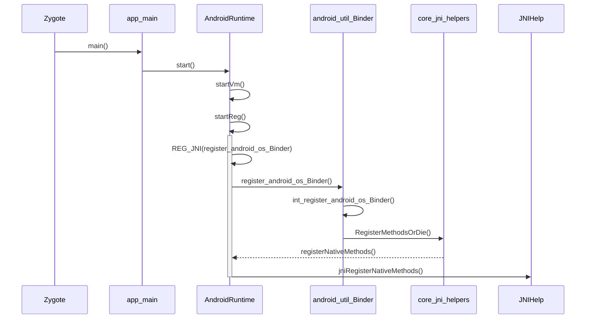

<!--more-->
<meta name="referrer" content="no-referrer"/>

# 前言
在[Binder机制03-Framework-Native](https://journeyos.github.io/archives/937d16d8.html)章节里我们分析了native(C/C++)层的binder架构，Android应用程序使用Java语言开发，Binder框架自然也少不了在Java层提供接口。所以Binder在framework层，采用JNI技术来调用native(C/C++)层的binder架构，最终把服务注册到Native层的ServiceManager中。
应用层的进程通过Framework的接口，其实也就是经过JNI技术进入Native C\C++，最终在Native层的ServiceManager中得到服务handle，最终转成相应的服务对象。

- Binder Framework JNI：[http://aospxref.com/android-11.0.0_r21/xref/frameworks/base/core/jni/](http://aospxref.com/android-11.0.0_r21/xref/frameworks/base/core/jni/)
   - android_util_Binder.h
   - android_util_Binder.cpp
   - android_os_Parcel.h
   - android_os_Parcel.cpp
   - android_os_HwBinder.h
   - android_os_HwBinder.cpp
   - android_os_HwParcel.h
   - android_os_HwParcel.cpp
- Binder Framework JAVA：[http://aospxref.com/android-11.0.0_r21/xref/frameworks/base/core/java/android/os/](http://aospxref.com/android-11.0.0_r21/xref/frameworks/base/core/java/android/os/)
   - Binder.java
   - IBinder.java
   - IInterface.java
   - Parcel.java
   - HwBinder.java
   - IHwBinder.java
   - IHwInterface.java
   - HwParcel.java
   - IServiceManager.java
   - ServiceManager.java
   - ServiceManagerNative.java(内含ServiceManagerProxy类)
   - BinderInternal.java([http://aospxref.com/android-11.0.0_r21/xref/frameworks/base/core/java/com/android/internal/os/](http://aospxref.com/android-11.0.0_r21/xref/frameworks/base/core/java/com/android/internal/os/))

# 框架
下图描述了Binder Framework Java层到C++层的衔接关系。

这里对图中Java层和JNI层的几个类做一下说明：

- IInterface(interface) ：供Java层Binder服务接口继承的接口
- IBinder(interface)：Java层IBinder类，提供了transaction方法来调用远程服务
- Binder(class)：实现了IBinder接口，封装了JNI的实现。Java层Binder服务的基类
- BInderProxy(class)：实现了IBinder接口，封装了JNI的实现。提供transac()方法调用远程服务
- JavaBBinderHolder(class) ：内部存储了JavaBBinder
- JavaBBinder(class)：将C++端的onTransact调用传递到Java端
- Parcel(class)：Java层的数据包装器。


这里的IInterface，IBinder和C++层的两个类是同名的。这个同名并不是巧合：它们不仅仅同名，它们所起的作用，以及其中包含的接口都是几乎一样的，区别仅仅在于一个是C++层，一个是Java层而已。
除了IInterface，IBinder之外，这里Binder与BinderProxy类也是与C++的类对应的，下面列出了Java层和C++层类的对应关系：

| **C++层** | **Java层** |
| --- | --- |
| IInterface | IInterface |
| IBinder | IBinder |
| BBinder | BBinder |
| BpProxy | BpProxy |
| Parcel | Parcel |

# JNI
JNI全称是Java Native Interface，这个是由Java虚拟机提供的机制。这个机制使得natvie代码可以和Java代码相互调用。简单的来说就是：我们可以在C/C++端调用Java代码，也可以在Java端调用C/C++代码。
实际上，在Android中很多的服务或者机制都是在C/C++层实现的，想要将这些实现复用到Java层就必须通过JNI进行衔接。AOSP中：

- frameworks/base/core/jni/ 目录下的源码就是专门用来对接Framework层的JNI实现
- frameworks/base/core/java/ 目录下的源码就是Framework层的调用JNI代码

其实大家看一下Binder.java的实现就会发现，这里面有不少的方法都是native关键字修饰的，并且没有方法实现体，这些方法其实都是在C++中实现的。

## Java
```cpp
http://aospxref.com/android-11.0.0_r21/xref/frameworks/base/core/java/android/os/Binder.java

package android.os;

public class Binder implements IBinder {
    private static native long getNativeFinalizer();
    public static final native int getCallingPid();
    public static final native int getCallingUid();
    public static final native boolean isHandlingTransaction();
    public static final native long clearCallingIdentity();
    public static final native void restoreCallingIdentity(long token);
    public static final native void setThreadStrictModePolicy(int policyMask);
    public static final native int getThreadStrictModePolicy();
    public static final native long setCallingWorkSourceUid(int workSource);
    public static final native int getCallingWorkSourceUid();
    public static final native long clearCallingWorkSource();
    public static final native void restoreCallingWorkSource(long token);
    public final native void markVintfStability();
    public static final native void flushPendingCommands();
    public static final native void blockUntilThreadAvailable();
    public final native @Nullable IBinder getExtension();
    public final native void setExtension(@Nullable IBinder extension);
    private static native long getNativeBBinderHolder();
    private static native long getFinalizer();
}
```
  方法都是native关键字修饰的，并且没有方法实现体。
## JNINativeMethod
```cpp
http://aospxref.com/android-11.0.0_r21/xref/frameworks/base/core/jni/android_util_Binder.cpp

static const JNINativeMethod gBinderMethods[] = {
     /* name, signature, funcPtr */
    { "getCallingPid", "()I", (void*)android_os_Binder_getCallingPid },
    { "getCallingUid", "()I", (void*)android_os_Binder_getCallingUid },
    { "isHandlingTransaction", "()Z", (void*)android_os_Binder_isHandlingTransaction },
    { "clearCallingIdentity", "()J", (void*)android_os_Binder_clearCallingIdentity },
    { "restoreCallingIdentity", "(J)V", (void*)android_os_Binder_restoreCallingIdentity },
    { "setThreadStrictModePolicy", "(I)V", (void*)android_os_Binder_setThreadStrictModePolicy },
    { "getThreadStrictModePolicy", "()I", (void*)android_os_Binder_getThreadStrictModePolicy },
    { "setCallingWorkSourceUid", "(I)J", (void*)android_os_Binder_setCallingWorkSourceUid },
    { "getCallingWorkSourceUid", "()I", (void*)android_os_Binder_getCallingWorkSourceUid },
    { "clearCallingWorkSource", "()J", (void*)android_os_Binder_clearCallingWorkSource },
    { "restoreCallingWorkSource", "(J)V", (void*)android_os_Binder_restoreCallingWorkSource },
    { "markVintfStability", "()V", (void*)android_os_Binder_markVintfStability},
    { "flushPendingCommands", "()V", (void*)android_os_Binder_flushPendingCommands },
    { "getNativeBBinderHolder", "()J", (void*)android_os_Binder_getNativeBBinderHolder },
    { "getNativeFinalizer", "()J", (void*)android_os_Binder_getNativeFinalizer },
    { "blockUntilThreadAvailable", "()V", (void*)android_os_Binder_blockUntilThreadAvailable },
    { "getExtension", "()Landroid/os/IBinder;", (void*)android_os_Binder_getExtension },
    { "setExtension", "(Landroid/os/IBinder;)V", (void*)android_os_Binder_setExtension },
};

const char* const kBinderPathName = "android/os/Binder";
```
  定义了一个JNINativeMethod类型的数组，数组的名字是gBinderMethods，里面存储的是native方法于JNI层函数的对应关系。只定义是没有用的，还需要注册它，注册的函数为：int_register_android_os_Binder(JNIEnv* env)。
关于JNI更详细的分析，我们以后也会有专门的章节讨论，这里就不再深入分析。我们这里只把Android系统起来后注册JNI的流程简单梳理。



## （附）C调用Java
上面我们知道了Java通过JNI调用C代码，那么C代码如何反过来调用Java代码呢？libbinder中的**BBinder::onTransacts**是如何能能够调用到Java中的**Binder::onTransact**的？
```cpp
http://aospxref.com/android-11.0.0_r21/xref/frameworks/base/core/jni/android_util_Binder.cpp

class JavaBBinder : public BBinder
{
public:
    status_t onTransact(
        uint32_t code, const Parcel& data, Parcel* reply, uint32_t flags = 0) override
    {
        JNIEnv* env = javavm_to_jnienv(mVM);

        IPCThreadState* thread_state = IPCThreadState::self();
        const int32_t strict_policy_before = thread_state->getStrictModePolicy();
    //调到了android.os.Binder类的exectTransac方法
        jboolean res = env->CallBooleanMethod(mObject, gBinderOffsets.mExecTransact,
            code, reinterpret_cast<jlong>(&data), reinterpret_cast<jlong>(reply), flags);

        ...

        return res != JNI_FALSE ? NO_ERROR : UNKNOWN_TRANSACTION;
    }
};


const char* const kBinderPathName = "android/os/Binder";

static int int_register_android_os_Binder(JNIEnv* env)
{
    jclass clazz = FindClassOrDie(env, kBinderPathName);

    gBinderOffsets.mClass = MakeGlobalRefOrDie(env, clazz);
    //gBinderOffsets.mExecTransact也就是android.os.Binder类的exectTransac方法
    gBinderOffsets.mExecTransact = GetMethodIDOrDie(env, clazz, "execTransact", "(IJJI)Z");
    gBinderOffsets.mGetInterfaceDescriptor = GetMethodIDOrDie(env, clazz, "getInterfaceDescriptor",
        "()Ljava/lang/String;");
    gBinderOffsets.mObject = GetFieldIDOrDie(env, clazz, "mObject", "J");

    return RegisterMethodsOrDie(
        env, kBinderPathName,
        gBinderMethods, NELEM(gBinderMethods));
}
```

- kBinderPathName为"android/os/Binder"，也就是Java的类是：android.os.Binder（[http://aospxref.com/android-11.0.0_r21/xref/frameworks/base/core/java/android/os/Binder.java](http://aospxref.com/android-11.0.0_r21/xref/frameworks/base/core/java/android/os/Binder.java)）
- GetMethodIDOrDie(env, clazz, "execTransact", "(IJJI)Z")
   - 函数是：android.os.Binder.execTransact()
   - (IJJI)Z表示：bool execTransact(int x1, long x2, long x3, int x4)
```cpp
http://aospxref.com/android-11.0.0_r21/xref/frameworks/base/core/java/android/os/Binder.java

// Entry point from android_util_Binder.cpp's onTransact
@UnsupportedAppUsage
    private boolean execTransact(int code, long dataObj, long replyObj,
                                 int flags) {
    // At that point, the parcel request headers haven't been parsed so we do not know what
    // WorkSource the caller has set. Use calling uid as the default.
    final int callingUid = Binder.getCallingUid();
    final long origWorkSource = ThreadLocalWorkSource.setUid(callingUid);
    try {
        return execTransactInternal(code, dataObj, replyObj, flags, callingUid);
    } finally {
        ThreadLocalWorkSource.restore(origWorkSource);
    }
}
```
看到注释也能知道是C代码调用到了这里，细节就不讨论了。


# 注册服务
```cpp
http://aospxref.com/android-11.0.0_r21/xref/frameworks/base/services/java/com/android/server/SystemServer.java

connectivity = new ConnectivityService(
        context, networkManagement, networkStats, networkPolicy);
ServiceManager.addService(Context.CONNECTIVITY_SERVICE, connectivity,
        /* allowIsolated= */ false,
        DUMP_FLAG_PRIORITY_HIGH | DUMP_FLAG_PRIORITY_NORMAL);
```
  SystemServer进程注册很多服务，其注册服务到方法很简单通过调用的是ServiceManager.java的addService()，那我们就从addService()开始分析。
## ServiceManager.addService()
```cpp
http://aospxref.com/android-11.0.0_r21/xref/frameworks/base/core/java/android/os/ServiceManager.java

public static void addService(String name, IBinder service, boolean allowIsolated,
        int dumpPriority) {
    try {
        getIServiceManager().addService(name, service, allowIsolated, dumpPriority);
    } catch (RemoteException e) {
        Log.e(TAG, "error in addService", e);
    }
}
```
  获取ServiceManagerProxy对象，执行addService操作。

## ServiceManager.getIServiceManager()
```cpp
http://aospxref.com/android-11.0.0_r21/xref/frameworks/base/core/java/android/os/ServiceManager.java

private static IServiceManager getIServiceManager() {
    if (sServiceManager != null) {
        return sServiceManager;
    }

    // Find the service manager
    sServiceManager = ServiceManagerNative
            .asInterface(Binder.allowBlocking(BinderInternal.getContextObject()));
    return sServiceManager;
}
```
  采用单例模式来获取ServiceManagerProxy对象。这里有三方法，先从BinderInternal.getContextObject()函数开始分析，其次是Binder.allowBlocking()函数，最后是ServiceManagerNative.asInterface()函数。

### BinderInternal.getContextObject()
```cpp
http://aospxref.com/android-11.0.0_r21/xref/frameworks/base/core/java/com/android/internal/os/BinderInternal.java

public static final native IBinder getContextObject();
```
BinderInternal.java中有一个native方法getContextObject()，通过JNI调用执行C的方法。在JNI的gBinderInternalMethods数组中找到了getContextObject的对应关系，即最终调用android_os_BinderInternal_getContextObject()方法。
#### android_os_BinderInternal_getContextObject()
```cpp
http://aospxref.com/android-11.0.0_r21/xref/frameworks/base/core/jni/android_util_Binder.cpp

static jobject android_os_BinderInternal_getContextObject(JNIEnv* env, jobject clazz)
{
    sp<IBinder> b = ProcessState::self()->getContextObject(NULL);
    return javaObjectForIBinder(env, b);
}
```
看到ProcessState::self()->getContextObject(NULL)这行代码，不能发现在[Binder机制03-Framework-Native](https://journeyos.github.io/archives/937d16d8.html)已经分析过，最终等价于 new BpBinder(0)，这里就不重复展开了。

#### javaObjectForIBinder()
```cpp
http://aospxref.com/android-11.0.0_r21/xref/frameworks/base/core/jni/android_util_Binder.cpp

jobject javaObjectForIBinder(JNIEnv* env, const sp<IBinder>& val)
{
    // N.B. This function is called from a @FastNative JNI method, so don't take locks around
    // calls to Java code or block the calling thread for a long time for any reason.

    if (val == NULL) return NULL;

    if (val->checkSubclass(&gBinderOffsets)) {
        //如果参数是JavaBBinder，返回用于创建它的Java对象；否则返回一个BinderProxy的对象。
        jobject object = static_cast<JavaBBinder*>(val.get())->object();
        return object;
    }

    //申请一个BinderProxyNativeData的内存
    BinderProxyNativeData* nativeData = new BinderProxyNativeData();
    nativeData->mOrgue = new DeathRecipientList;
    nativeData->mObject = val;

    //创建BinderProxy对象，设置BinderProxy的相关参数，能够与JAVA层的BinderProx参与工作
    jobject object = env->CallStaticObjectMethod(gBinderProxyOffsets.mClass,
            gBinderProxyOffsets.mGetInstance, (jlong) nativeData, (jlong) val.get());
    if (env->ExceptionCheck()) {
        // In the exception case, getInstance still took ownership of nativeData.
        return NULL;
    }
    BinderProxyNativeData* actualNativeData = getBPNativeData(env, object);
    if (actualNativeData == nativeData) {
        // Created a new Proxy
        uint32_t numProxies = gNumProxies.fetch_add(1, std::memory_order_relaxed);
        uint32_t numLastWarned = gProxiesWarned.load(std::memory_order_relaxed);
        if (numProxies >= numLastWarned + PROXY_WARN_INTERVAL) {
            // Multiple threads can get here, make sure only one of them gets to
            // update the warn counter.
            if (gProxiesWarned.compare_exchange_strong(numLastWarned,
                        numLastWarned + PROXY_WARN_INTERVAL, std::memory_order_relaxed)) {
                ALOGW("Unexpectedly many live BinderProxies: %d\n", numProxies);
            }
        }
    } else {
        delete nativeData;
    }

    return object;
}

```
javaObjectForIBinder()中，申请一个BinderProxyNativeData的内存，传入的BpBinder的对象地址保存到BinderProxyNativeData.mObject成员变量中，通过虚拟机的转换，BinderProxyNativeData在JAVA空间会被转换成 BinderProxy对象。
最终，BinderInternal.getContextObject()等价于 new BinderProxy()，所以getIServiceManager等价于new ServiceManagerProxy(new BinderProxy())。

### Binder.allowBlocking()
```cpp
http://aospxref.com/android-11.0.0_r21/xref/frameworks/base/core/java/android/os/Binder.java

public static IBinder allowBlocking(IBinder binder) {
    try {
        if (binder instanceof BinderProxy) {
            //如果binder是代理类，则设置非阻塞式
            ((BinderProxy) binder).mWarnOnBlocking = false;
        } else if (binder != null && binder.getInterfaceDescriptor() != null
                && binder.queryLocalInterface(binder.getInterfaceDescriptor()) == null) {
            //如果binder是本地对象，binder描述符不为空，且和本地binder描述符不相同
            Log.w(TAG, "Unable to allow blocking on interface " + binder);
        }
    } catch (RemoteException ignored) {
    }
    return binder;
}
```

- 允许在给定接口上阻塞调用，重写请求的{setWarnOnBlocking（boolean）}值。
- 只有当您完全确定远程接口是一个永远无法升级的内置系统组件时，才应该很少调用此命令。尤其是，决不能对包托管的、可升级或替换的接口调用此命令，否则，如果远程接口接入，将有系统不稳定的风险。


### ServiceManagerNative.asInterface()
```cpp
http://aospxref.com/android-11.0.0_r21/xref/frameworks/base/core/java/android/os/ServiceManagerNative.java

public static IServiceManager asInterface(IBinder obj) {
    if (obj == null) {
        return null;
    }

    // ServiceManager is never local
    return new ServiceManagerProxy(obj);
}

class ServiceManagerProxy implements IServiceManager {
public ServiceManagerProxy(IBinder remote) {
        mRemote = remote;
        mServiceManager = IServiceManager.Stub.asInterface(remote);
    }

    ...

    private IBinder mRemote;

    private IServiceManager mServiceManager;
}
```
ServiceManagerProxy是ServiceManagerNative类的内部类, mRemote为BinderProxy对象，该BinderProxy对象对应于BpBinder(0)，其作为binder代理端，指向native的层的Service Manager。
ServiceManager.getIServiceManager()最终等价于new ServiceManagerProxy(new BinderProxy())。所以getIServiceManager().addService()也就是ServiceManagerNative.addService();
Framework层的ServiceManager的调用实际的工作确实交给了ServiceManagerProxy的成员变量BinderProxy；而BinderProxy通过JNI的方式，最终会调用BpBinder对象；可见上层binder结构的核心功能依赖native架构的服务来完成的。


## ServiceManagerProxy.addService()
```cpp
http://aospxref.com/android-11.0.0_r21/xref/frameworks/base/core/java/android/os/ServiceManagerNative.java

class ServiceManagerProxy implements IServiceManager {
public ServiceManagerProxy(IBinder remote) {
        mRemote = remote;
        mServiceManager = IServiceManager.Stub.asInterface(remote);
    }

    ...

    public void addService(String name, IBinder service, boolean allowIsolated, int dumpPriority)
            throws RemoteException {
        mServiceManager.addService(name, service, allowIsolated, dumpPriority);
    }

    ...

    private IServiceManager mServiceManager;
}
```
  IServiceManager其实就是[IServiceManager.aidl](http://aospxref.com/android-11.0.0_r21/xref/frameworks/native/libs/binder/aidl/android/os/IServiceManager.aidl#30)，最终调到ServiceManager.ddService()方法里。[Binder机制03-Framework-Native](https://journeyos.github.io/archives/937d16d8.html)有分析ServiceManager.ddService()。
```cpp
http://aospxref.com/android-11.0.0_r21/xref/frameworks/native/cmds/servicemanager/ServiceManager.cpp

Status ServiceManager::addService(const std::string& name, const sp<IBinder>& binder, bool allowIsolated, int32_t dumpPriority) {
    ...

    //添加 Service 到 mNameToService 中，完成 Binder Service 注册过程
    mNameToService[name] = Service {
        .binder = binder,
        .allowIsolated = allowIsolated,
        .dumpPriority = dumpPriority,
        .debugPid = ctx.debugPid,
    };

    auto it = mNameToRegistrationCallback.find(name);
    if (it != mNameToRegistrationCallback.end()) {
        for (const sp<IServiceCallback>& cb : it->second) {
            mNameToService[name].guaranteeClient = true;
            // permission checked in registerForNotifications
            cb->onRegistration(name, binder);
        }
    }

    return Status::ok();
}
```

## 小结
Framework层的ServiceManager的调用实际的工作确实交给ServiceManagerProxy的成员变量BinderProxy；而BinderProxy通过jni方式，最终会调用BpBinder对象；可见上层binder架构的核心功能依赖native架构的服务来完成的。

# 获取服务
## ServiceManager.getService()
```cpp
http://aospxref.com/android-11.0.0_r21/xref/frameworks/base/core/java/android/os/ServiceManager.java

public static IBinder getService(String name) {
    try {
        //先从缓存中查看
        IBinder service = sCache.get(name);
        if (service != null) {
            return service;
        } else {
            //从Native层服务列表中取服务对象
            return Binder.allowBlocking(rawGetService(name));
        }
    } catch (RemoteException e) {
        Log.e(TAG, "error in getService", e);
    }
    return null;
}

private static IBinder rawGetService(String name) throws RemoteException {
    ...
    //即为ServiceManagerProxy.getService()
    final IBinder binder = getIServiceManager().getService(name);
    ...
    return binder;
}
```

- 先从缓存中查看
- 缓存中没有则从Native层服务列表中取服务对象即为ServiceManagerProxy.getService()


## ServiceManagerProxy.getService()
```cpp
http://aospxref.com/android-11.0.0_r21/xref/frameworks/base/core/java/android/os/ServiceManagerNative.java

class ServiceManagerProxy implements IServiceManager {
public ServiceManagerProxy(IBinder remote) {
        mRemote = remote;
        mServiceManager = IServiceManager.Stub.asInterface(remote);
    }

    ...

    public IBinder getService(String name) throws RemoteException {
        // Same as checkService (old versions of servicemanager had both methods).
        return mServiceManager.checkService(name);
    }

    ...

    private IServiceManager mServiceManager;
}
```
IServiceManager其实就是[IServiceManager.aidl](http://aospxref.com/android-11.0.0_r21/xref/frameworks/native/libs/binder/aidl/android/os/IServiceManager.aidl#30)，最终调到ServiceManager.checkService()方法里。[Binder机制03-Framework-Native](https://journeyos.github.io/archives/937d16d8.html)有分析ServiceManager.checkService()。
## ServiceManager.checkService()
```cpp
ttp://aospxref.com/android-11.0.0_r21/xref/frameworks/native/cmds/servicemanager/ServiceManager.h

//定义Service结构体
struct Service {
    sp<IBinder> binder; // not null
    bool allowIsolated;
    int32_t dumpPriority;
    bool hasClients = false; // notifications sent on true -> false.
    bool guaranteeClient = false; // forces the client check to true
    pid_t debugPid = 0; // the process in which this service runs

    // the number of clients of the service, including servicemanager itself
    ssize_t getNodeStrongRefCount();
};

using ServiceMap = std::map<std::string, Service>;

//用于保存添加进来的Services
ServiceMap mNameToService;


http://aospxref.com/android-11.0.0_r21/xref/frameworks/native/cmds/servicemanager/ServiceManager.cpp

Status ServiceManager::checkService(const std::string& name, sp<IBinder>* outBinder) {
    *outBinder = tryGetService(name, false);
    // returns ok regardless of result for legacy reasons
    return Status::ok();
}

sp<IBinder> ServiceManager::tryGetService(const std::string& name, bool startIfNotFound) {
    auto ctx = mAccess->getCallingContext();

    sp<IBinder> out;
    Service* service = nullptr;
    //查找mNameToServices是否存在名字为name的Service
    if (auto it = mNameToService.find(name); it != mNameToService.end()) {
        service = &(it->second);

        if (!service->allowIsolated) {
            uid_t appid = multiuser_get_app_id(ctx.uid);
            bool isIsolated = appid >= AID_ISOLATED_START && appid <= AID_ISOLATED_END;

            if (isIsolated) {
                return nullptr;
            }
        }
        out = service->binder;
    }

    if (!mAccess->canFind(ctx, name)) {
        return nullptr;
    }

    if (!out && startIfNotFound) {
        tryStartService(name);
    }

    if (out) {
        // Setting this guarantee each time we hand out a binder ensures that the client-checking
        // loop knows about the event even if the client immediately drops the service
        service->guaranteeClient = true;
    }

    return out;
}
```


## 小结
和注册服务类似，都是需要依赖Native层的接口与Binder驱动通信，获取服务主要是从Native的ServieManager取到Binder对象。


# 总结
Framework层获取服务、注册服务，其实都是由JAVA层的ServiceManager代理ServiecManagerProxy，通过Binder驱动，访问Native层的ServiceManager，进行服务注册和获取动作。native层中，binder是C/S架构，分为Bn端(Server)和Bp端(Client)。对于Java层在命令与架构上非常相近，同时实现了一套IPC通信架构。


- 上层framework层的Binder逻辑是建立在Native层架构基础上的，核心逻辑都是交于Native层来处理
- framework层的ServiceManager类与Native层的功能并不完全对应，framework层的ServiceManager的实现对最终是通过BinderProxy传递给Native层来完成的。
- ServiceManager：通过getIServiceManager方法获取的是ServiceManagerProxy对象。ServiceMnager的addService()，getService()实际工作都交给ServiceManagerProxy的相应方法来处理。
- ServiceManagerProxy：其成员变量mRemote指向BinderProxy对象，ServiceManagerProxy的addService()，getService()方法最终是交给mRemote去完成。
- ServiceManagerNative：其方法asInterface()返回的是ServiceManagerProxy对象，ServiceManager便是借助ServiceManagerNative类来找到ServiceManagerProxy。
- Binder：其成员mObject和方法execTransact()用于native方法
- BinderInternal：内部有一个GcWatcher类，用于处理和调试与Binder相关的拦击回收。
- IBinder：接口中常量FLAG_ONEWAY:客户端利用binder跟服务端通信是阻塞式的，但如果设置了FLAG_ONEWAY，这成为非阻塞的调用方式，客户端能立即返回，服务端采用回调方式来通知客户端完成情况。另外IBinder接口有一个内部接口DeathDecipent(死亡通告)。


# 参考
[Android Binder机制原理java层系列二（有图有代码很详细）](https://www.jianshu.com/p/ee56313a2c9e)
[图解Android - Binder 和 Service](https://www.cnblogs.com/samchen2009/p/3316001.html)
